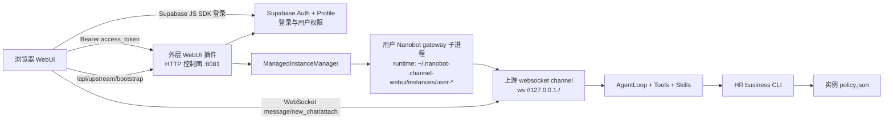

# 多实例 WebSocket Channel 机制与旧逻辑清理方案

本文记录当前 WebUI 插件在多实例模式下的实现机制，并作为后续清理旧 channel 逻辑的工作说明。当前方向是：插件不再把所有用户放进同一个 Nanobot 实例里做多租户，而是按登录用户启动独立 Nanobot runtime，并复用上游默认 `websocket` channel 承载对话。

## 当前结论

当前系统已经从“单实例 WebUI channel 承载所有对话”转向“WebUI 插件控制面 + 用户独立 Nanobot gateway 子进程 + 上游 `websocket` channel”。

在 Supabase 登录模式下：

- 外层 `webui_plugin` 仍负责浏览器静态资源、登录态校验、权限解析、实例编排、会话 API 代理、设置页和管理接口。
- 每个登录用户会获得一个独立 `nanobot gateway --config <instance-config.json>` 子进程，实例有自己的 config、workspace、sessions、skills、policy 和 websocket 端口。
- 浏览器真正对话时连接的是用户实例里的上游 `websocket` channel，而不是插件原先实现的 `/ws` 对话通道。
- HR 业务技能放在实例 workspace 的 `skills/` 目录中，读取实例内 `.nanobot_channel_webui/policies/policy.json` 做数据权限判断。
- 插件原先的本地对话 channel 逻辑只应作为过渡兼容逻辑，不应继续作为企业多用户主链路扩展。

## 运行拓扑



## 启动与连接流程

### 1. 外层 WebUI 插件启动

外层 `WebUIChannel` 仍作为 Nanobot channel 启动，但它现在更像一个 WebUI 控制面。它创建 aiohttp 应用，注册以下类型的路由：

- 静态页面：`/`、`/assets/*`
- 登录态：`/api/auth/me`
- 上游实例代理：`/api/upstream/bootstrap`、`/api/upstream/sessions`、`/api/upstream/sessions/{chat_id}/webui-thread`、`DELETE /api/upstream/sessions/{chat_id}`
- 管理与设置：`/api/settings/*`
- 文件与媒体：`/uploads/{chat_id}`、`/media/{token}`、`/api/workspaces/{chat_id}`
- 旧本地对话兼容：`/ws`、`/sessions`、`DELETE /sessions/{chat_id}`

页面 bootstrap 中会注入：

```json
{
  "authMode": "supabase",
  "supabase": {
    "url": "https://example.supabase.co",
    "anonKey": "..."
  },
  "upstreamGateway": {
    "enabled": true,
    "baseUrl": "",
    "bootstrapUrl": "/api/upstream/bootstrap"
  }
}
```

前端看到 `upstreamGateway.enabled = true` 后，会走上游 websocket 模式。

### 2. 用户登录与实例 bootstrap

浏览器使用 Supabase Auth `access_token` 请求 `/api/upstream/bootstrap`。插件完成以下步骤：

1. 通过 `WebUIAccessControl` 校验 Supabase JWT，并从权限画像表解析当前用户。
2. 调用 `ManagedInstanceBootstrapService.bootstrap_for_user(user)`。
3. `InstanceSpecBuilder` 根据用户和基础 Nanobot config 生成 `ManagedInstanceSpec`。
4. `ManagedInstanceManager` 同步实例 workspace、写入实例 `config.json`，并启动或复用该用户的 `nanobot gateway` 子进程。
5. 插件向实例内 websocket channel 的 `/webui/bootstrap` 请求短期连接信息。
6. 浏览器拿到 `ws_url` 和 `token` 后直连实例 websocket channel。

实例 ID 使用登录用户 ID 派生，例如：

```text
user-w4axjmqago9u6dw
```

实例目录形如：

```text
~/.nanobot-channel-webui/instances/user-w4axjmqago9u6dw/
  config.json
  logs/gateway.log
  workspace/
```

### 3. 实例配置生成

`InstanceSpecBuilder` 会复制基础 config，然后修改关键字段，并将派生结果写入实例目录下的 `config.json`：

- `agents.defaults.workspace` 指向用户实例 workspace。
- `tools.restrictToWorkspace` 强制写入 `true`，让文件工具和 exec guard 都以该用户实例 workspace 为边界。
- `gateway.port` 按实例 ID 派生，避免多个实例端口冲突。
- `channels` 被重置为只启用上游 `websocket` channel。
- websocket channel 使用 `127.0.0.1`、独立端口、固定派生 token 和 streaming。

`ManagedInstanceManager` 随后执行：

```bash
nanobot gateway --config ~/.nanobot-channel-webui/instances/<user>/config.json
```

这意味着用户实例默认不启用外层 `webui_plugin`、Feishu 等其它 channel；它只负责承载浏览器对话。Dream、cron、heartbeat、workspace templates、WebUI turn coordinator、session flush 等能力由上游 `nanobot gateway` 完整启动流程负责，控制面不再复刻这些内部编排。

### 4. 实例 workspace 同步

`sync_instance_workspace` 负责创建插件管理的实例运行时内容：

```text
workspace/
  skills/
    hr-db-ops/
    hr-policy/
    hr-query-analysis-router/
    hr-schema/
    tenant-runtime-guard/
  .nanobot_channel_webui/
    policies/
      policy.json
    managed-skills.json
```

技能包从插件安装目录复制到实例 workspace 内，而不是创建指向 site-packages 的符号链接。
这样在 `tools.restrictToWorkspace=true` 时，Nanobot 文件工具解析真实路径后仍然停留在当前实例
workspace 边界内。

其中 `policy.json` 是当前用户权限快照，包含：

- `user_id`、`email`、`tenant_id`
- `role`、`business_role`
- `scopes.company`
- `resources`
- `skills`

HR CLI 现在会在实例 workspace 下自动发现 `.nanobot_channel_webui/policies/policy.json`，同时实例子进程环境会注入 `NANOBOT_CONFIG=<instance>/config.json` 和 `NANOBOT_WEBUI_POLICY_FILE=<workspace>/.nanobot_channel_webui/policies/policy.json`，因此模型不需要手工查找或注入这些路径。

实例启动后，上游 `nanobot gateway` 会对该实例 workspace 执行标准 workspace template 同步，因此 `AGENTS.md`、`SOUL.md`、`HEARTBEAT.md` 等根级运行时文件应由完整 gateway 启动语义生成和维护，而不是从全局 `~/.nanobot/workspace` 复用。

### 5. 浏览器对话路径

前端 `WebSocketClient` 在 upstream 模式下：

1. 请求 `/api/upstream/bootstrap`。
2. 读取返回的 `ws_url` 和 `token`。
3. 将 token 写入 websocket URL query。
4. 连接用户实例内的上游 websocket channel。

消息协议也切换为上游 websocket channel 使用的事件形态：

- 新会话：`{ "type": "new_chat", "webui": true }`
- 发送消息：`{ "type": "message", "chat_id": "...", "content": "...", "webui": true }`
- 切换会话：`{ "type": "attach", "chat_id": "..." }`
- 停止：`{ "type": "message", "chat_id": "...", "content": "/stop", "webui": true }`

这和旧插件本地 `/ws` 使用的 `message.send`、`session.switch`、`message.cancel` 已经不同。

### 6. 会话列表、历史和删除

因为浏览器不能直接带服务端受控 token 去访问实例 HTTP sidecar，外层插件保留上游代理接口：

- `GET /api/upstream/sessions`
- `GET /api/upstream/sessions/{chat_id}/webui-thread`
- `DELETE /api/upstream/sessions/{chat_id}`

这些接口会先鉴权，再 bootstrap 对应用户实例，然后用实例 websocket channel 的 token 访问实例侧 HTTP sidecar。

当前会话列表不使用外层账号数据库索引。Supabase 只负责登录用户、角色和权限配置；会话列表、会话历史和删除均以用户实例内的 websocket session 为准。外层插件的 `/api/upstream/sessions` 只是鉴权代理，不再维护独立 session index 作为列表或归属判断来源。

需要注意：实例侧 session key 使用上游 websocket channel 语义：

```text
websocket:<chat_id>
```

删除会话时，浏览器对外层插件发 `DELETE`，但外层插件代理到实例 sidecar 时使用：

```http
GET /api/sessions/websocket:<chat_id>/delete
```

这是因为上游 websocket sidecar 基于 `websockets`，HTTP sidecar 只接受 `GET`。

## 权限与业务技能机制

多实例模式下，隔离边界不再主要依赖同一个 AgentLoop 里的多租户上下文，而是分层实现：

1. **实例隔离**
   - 每个用户独立 workspace。
   - 会话历史和记忆写入该用户实例 workspace。
   - 技能目录按用户权限同步。

2. **策略文件**
   - 插件根据登录用户生成 `policy.json`。
   - 业务 CLI 从实例 workspace 自动发现该 policy。

3. **业务 CLI 与 repository 兜底**
   - 模型必须通过 `nanobot-webui-business hr business ...` 访问 HR 数据。
   - `runtime/policy.py` 做命令级资源、动作、scope 判断。
   - `runtime/repository.py` 在查询、写入、删除、验证层继续做 company scope 过滤。

4. **聚合命令降低绕路**
   - 高频组合问题应提供聚合 capability。
   - 例如“我能看哪些公司，以及这些公司下面有哪些部门”现在使用：

```bash
nanobot-webui-business hr business query organization-tree
```

该命令一次返回当前账号授权公司和部门树，避免 `list-companies + N 次 list-departments`。

## 当前仍保留的旧 channel 逻辑

以下逻辑来自旧的插件本地 channel 实现，在多实例 upstream 模式下不再是主链路。

### 本地 `/ws` 对话通道

位置：`src/nanobot_channel_webui/channel.py`

相关对象：

- `WebUIHook`
- `ConnectionRegistry`
- `TurnAccumulator`
- `_handle_ws`
- `_handle_message`
- `send`
- `send_delta`
- `_replay_active_turn`

旧职责：

- 接收浏览器 websocket。
- 自行创建 chat ID。
- 将浏览器消息发布到外层 Nanobot AgentLoop。
- 通过 hook 和 `send_delta` 把流式输出、工具进度、最终消息推回浏览器。

现状：

- Supabase 多实例模式下，浏览器连接用户实例的上游 websocket channel。
- 这些逻辑只作为非 upstream 兼容路径存在。
- 如果产品明确不再支持单实例 fallback，这部分应进入清理。

### 本地 session 文件与外层 session index

旧职责：

- 从外层插件 workspace 的 `sessions/` 读取会话。
- 用外层 session index 做用户到 chat ID 的归属映射。

现状：

- upstream 模式下，前端使用 `/api/upstream/sessions`。
- 会话实际存储在用户实例 workspace 的 `sessions/websocket_*.jsonl`。
- 外层本地 `/sessions`、本地删除接口和 `SessionQueryService` 已移除。
- `SessionIndexService` 仍保留为历史兼容模块和旧测试对象，但不再参与 upstream 会话列表、会话访问判断和 runtime 会话计数。
- workspace/media 访问判断现在通过用户实例 sidecar 的 `/api/sessions` 校验 `websocket:<chat_id>` 是否存在。

### 外层 AgentLoop 权限注入

相关对象：

- `attach_webui_runtime`
- `attach_tenant_runtime`
- `_ensure_runtime_attached`
- `metadata["_webui_policy"]`

旧职责：

- 在外层单实例 AgentLoop 中绑定用户、租户、policy context。
- 包装工具注册表，控制 `read_file`、`list_dir`、`exec` 等工具。

现状：

- upstream 主链路不再使用外层 AgentLoop 执行业务对话。
- 但权限模块本身仍有价值，后续应迁移或复用到用户实例 runtime，而不是直接删除。
- 在确认实例内工具治理方案之前，不应删除 `permissions/`、`tenant_runtime/` 和业务 CLI guard。

### 前端本地 channel 兼容分支

相关文件：

- `frontend/src/ws-client.ts`
- `frontend/src/use-websocket-session.ts`
- `frontend/src/api.ts`

旧职责：

- `upstreamGateway.enabled = false` 时连接 `/ws`。
- 使用旧命令：`session.new`、`message.send`、`session.switch`、`message.cancel`。
- 使用 `/sessions`、`DELETE /sessions/{chat_id}`。

现状：

- Supabase 多实例模式下前端会走 upstream 分支。
- 如果单实例 fallback 退出产品范围，前端兼容分支可以清理。

## 2026-06-05 清理执行结果

- 已完成 `CH-CLEAN-001`：前端删除本地 `/ws` fallback，统一通过 `/api/upstream/bootstrap` 获取用户实例 websocket 地址。
- 已完成 `CH-CLEAN-002`：外层插件删除 `/ws`、`/sessions`、`DELETE /sessions/{chat_id}`，不再承载浏览器业务对话。
- 已完成 `CH-CLEAN-003` 的核心会话入口：会话列表、历史和删除均走 `/api/upstream/*` 代理到用户实例。
- 已删除旧本地对话辅助模块：`ConnectionRegistry`、`TurnAccumulator`、旧 `protocol.py`、旧 `sessions.py`、外层 `WebUIHook` 和旧 `compat.runtime` 注入。
- 仍需后续处理：上传文件与 artifacts 进入用户实例边界、权限工具网关在用户实例 runtime 内挂载，以及是否废弃外部 `upstream_gateway_url` 兼容配置。

## 清理原则

旧逻辑清理不是简单删除文件，而是把插件职责收敛为：

- **保留：** 静态 WebUI、认证、实例编排、上游 API 代理、设置管理、上传媒体、业务模块打包。
- **迁移：** 对话流、会话历史、会话删除、流式事件、工具进度到上游 websocket channel。
- **下沉：** 权限工具网关、动态技能视图、audit 等能力应进入用户实例 runtime 或业务 CLI/repository 层。
- **删除：** 外层插件自实现的本地聊天 channel、外层本地 session 存储和前端本地 `/ws` 兼容分支。

## 建议清理阶段

### 阶段 1：确认 upstream-only 产品边界

目标：明确不再支持单实例 WebUI fallback。

要做：

- 将 `upstreamGateway.enabled` 在 Supabase 模式下视为强制路径。
- 明确 `upstream_gateway_url` 外部上游模式是否还保留。如果只保留托管实例，应标记为废弃。
- 为 upstream 模式补齐端到端回归测试：bootstrap、session list、history、delete、message send、cancel。

验收：

- 普通用户和 admin 均通过 `/api/upstream/bootstrap` 连接独立实例。
- 前端不再依赖 `/ws` 才能完成基础对话。

### 阶段 2：清理前端本地 channel 分支

目标：前端只保留 upstream websocket 协议。

已完成：

- `ws-client.ts` 只通过 `/api/upstream/bootstrap` 获取用户实例 websocket 地址。
- `use-websocket-session.ts` 只发送上游 `new_chat`、`message`、`attach` 和 `/stop` 事件。
- `api.ts` 只使用 `/api/upstream/sessions`、`/api/upstream/sessions/{chat_id}/webui-thread` 和 upstream delete。
- 切换会话先通过 HTTP sidecar 加载目标历史，再提交 assistant-ui 当前 thread，并只在最新请求仍有效时 attach websocket channel，避免旧响应覆盖新 thread。

保留：

- upstream 事件规范化逻辑。
- `loadUpstreamThread`、`loadUpstreamSessions`、upstream delete。

验收：

- 新会话、切换会话、删除会话、刷新会话列表均走 `/api/upstream/*` 或实例 websocket。

### 阶段 3：清理外层本地 `/ws` 对话实现

目标：外层插件不再作为对话 channel。

可清理：

- aiohttp 路由：`/ws`、`/sessions`、`DELETE /sessions/{chat_id}`。
- `_handle_ws`、`_handle_message`、本地 session switch/new/cancel 逻辑。
- `send`、`send_delta` 中只服务本地 `/ws` 的推送路径。
- `ConnectionRegistry`、`TurnAccumulator`、`WebUIHook` 中只服务本地流式事件的部分。

保留或迁移：

- 如果上游 websocket channel 仍需要 WebUI 风格的工具进度事件，应在用户实例 runtime 通过 hooks 接入，而不是保留外层本地 hook。
- 如果媒体展示仍需要 `MediaService`，保留 `/media/{token}`。

验收：

- `WebUIChannel` 不再需要继承完整聊天 channel 行为，定位变成 WebUI 控制面。
- 外层 Nanobot AgentLoop 不参与浏览器业务对话。

### 阶段 4：收敛 session 和 workspace 相关逻辑

目标：会话历史以用户实例 workspace 为准。

可清理：

- 外层 `SessionQueryService` 的本地会话列表和删除路径。
- 外层 session index 中只为旧本地 `/ws` 服务的字段和写入逻辑。

需要先补齐：

- 上传文件如何进入用户实例对话。当前 upstream 发送消息时只发送 `content`，未把附件路径作为 media 传给实例 websocket；这部分需要单独设计。
- workspace 面板如何展示实例内 artifacts。当前 `/api/workspaces/{chat_id}` 仍基于外层 workspace，需要迁移到实例 workspace 或授权 artifacts 代理。

验收：

- 会话列表、历史、附件、artifacts 都来自同一个用户实例边界。
- 普通用户不能通过外层 workspace 看到其他用户或历史单实例内容。

### 阶段 5：重定位权限注入和治理能力

目标：把权限治理放到真正执行对话的用户实例中。

不能直接删除：

- `permissions/`
- `tenant_runtime/`
- `CommandPolicyGuard`
- `AuthorizingToolRegistry`
- 动态技能视图
- audit 相关代码

原因：

- 多实例解决了 workspace、memory、session 的硬隔离，但工具调用仍需要策略边界。
- HR CLI 和 repository 已经有数据层兜底，但普通工具、文件读取、shell 访问、audit 仍需要实例内治理。

建议：

- 在 `ProgrammaticGatewayRuntimeOptions` 中显式配置实例 hooks 和工具网关注入。
- 让 `build_programmatic_gateway_runtime` 在用户实例内挂载权限 runtime，而不是只在外层 `webui_plugin` AgentLoop 上挂载。
- 对实例内 `exec/read_file/list_dir` 增加 scoped 用户回归测试。

验收：

- 用户实例内模型看不到或不能调用未授权敏感工具。
- `nanobot-webui-business hr ...` 继续由 policy 文件和业务 CLI 限制。
- audit 写入实例或租户级授权审计空间。

## 建议新增跟踪项

后续清理建议拆成以下任务：

1. `CH-CLEAN-001`：前端 upstream-only 协议收敛。
2. `CH-CLEAN-002`：删除外层 `/ws` 本地对话 channel。
3. `CH-CLEAN-003`：会话列表、历史、删除全部代理到实例 workspace。
4. `CH-CLEAN-004`：上传文件与 artifacts 迁移到实例边界。
5. `CH-CLEAN-005`：权限工具网关迁移到用户实例 runtime。
6. `CH-CLEAN-006`：删除或废弃 `upstream_gateway_url` 外部上游兼容配置。

## 判断一段逻辑能否删除

清理时可以用以下问题判断：

1. 这段逻辑是否只服务 `/ws`、`message.send`、`session.switch`、`message.cancel`？
2. 这段逻辑是否只读取外层 workspace 的 `sessions/`？
3. 这段逻辑是否只为外层 AgentLoop 绑定 WebUI policy？
4. 当前 upstream websocket channel 是否已经提供等价能力？
5. 删除后是否会影响登录、实例启动、管理页、上传、媒体或授权审计？

如果前 3 个问题为“是”，第 4 个问题为“是”，且第 5 个问题为“否”，就可以进入删除候选。

如果第 5 个问题为“是”，不要直接删除，应先迁移到用户实例边界。
