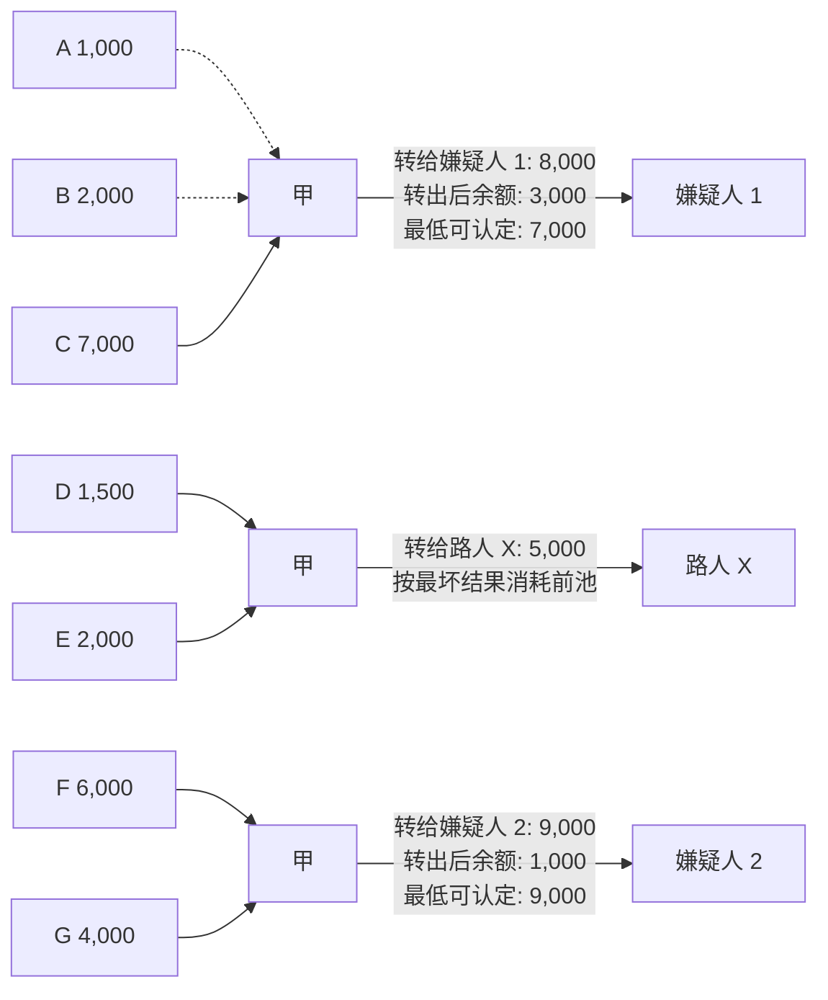
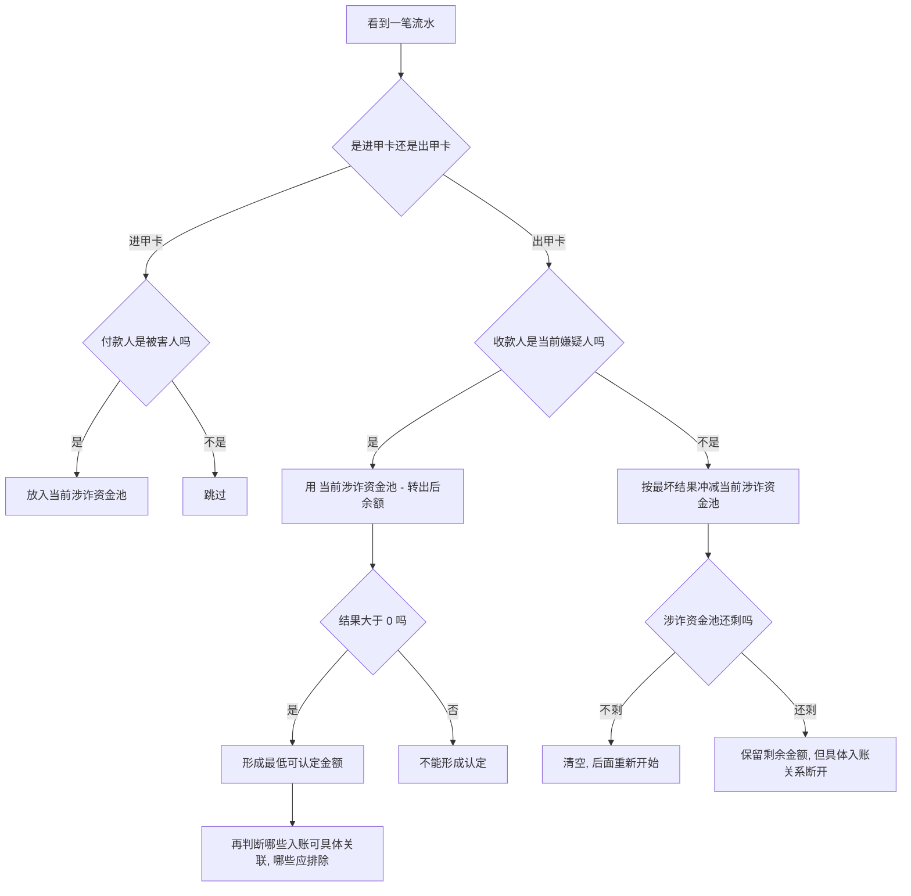

# 涉诈资金审计金额认定逻辑说明

这份文档不从概念开始讲，而是从一组示例资金流水开始，沿着时间线一步一步解释：

- 哪些钱进入“涉诈资金池”
- 为什么嫌疑人不是收了多少就认定多少
- 什么叫“最低可认定”
- 什么叫“余额可包含，应排除具体流向”
- 为什么中间转给别人会影响后面的认定

先记住一句话：

```text
这个算法不是尽量多算钱，而是尽量稳地认定钱。
```

也就是：

```text
只认定在最保守假设下，也一定已经流向嫌疑人的金额。
```

## 示例流水

假设办案人员已经知道这些人是被害人：

```text
被害人：A、B、C、D、E、F、G
中转账户：甲
嫌疑人：嫌疑人 1、嫌疑人 2
其他收款人：路人 X
```

甲这张卡的流水如下：

| 顺序 | 时间 | 交易 | 金额 | 转出后余额 | 说明 |
| --- | --- | --- | ---: | ---: | --- |
| 1 | 10:00 | A -> 甲 | 1,000 | - | 被害人入账 |
| 2 | 10:01 | B -> 甲 | 2,000 | - | 被害人入账 |
| 3 | 10:02 | C -> 甲 | 7,000 | - | 被害人入账 |
| 4 | 10:03 | 甲 -> 嫌疑人 1 | 8,000 | 3,000 | 第一次嫌疑人出账 |
| 5 | 10:04 | D -> 甲 | 1,500 | - | 新的一段被害人入账 |
| 6 | 10:05 | E -> 甲 | 2,000 | - | 新的一段被害人入账 |
| 7 | 10:06 | 甲 -> 路人 X | 5,000 | 500 | 转给非嫌疑人 |
| 8 | 10:07 | F -> 甲 | 6,000 | - | 重新累计 |
| 9 | 10:08 | G -> 甲 | 4,000 | - | 重新累计 |
| 10 | 10:09 | 甲 -> 嫌疑人 2 | 9,000 | 1,000 | 第二次嫌疑人出账 |

整套算法就是沿着这张表从上往下走。

## 先看整体图



图里有两种被害人入账线：

```text
实线：可以作为具体流向证据
虚线：参与金额计算，但余额可能包含它，应排除具体流向
```

下面逐步解释为什么。

## 第一步：A、B、C 打钱给甲

时间线前 3 笔是：

```text
A -> 甲：1,000
B -> 甲：2,000
C -> 甲：7,000
```

这些都是被害人打给甲，所以都进入当前的“涉诈资金池”。

```text
当前涉诈资金池 = 1,000 + 2,000 + 7,000 = 10,000
```

这一步先不判断谁是嫌疑人，只是记账：

```text
甲这张卡里，当前累计进来了 10,000 涉诈资金。
```

## 第二步：甲转给嫌疑人 1

第 4 笔：

```text
甲 -> 嫌疑人 1：8,000
转出后余额：3,000
```

这里很多人第一反应会说：

```text
嫌疑人 1 收了 8,000，那就认定 8,000。
```

算法不是这么算。

算法要更保守，它会问：

```text
甲卡里转完以后还剩 3,000。
这 3,000 有没有可能也是前面被骗的钱？
```

答案是：有可能。

为了不多认定、不冤枉嫌疑人，算法先假设：

```text
这 3,000 余额全部都是被骗钱，还没有转给嫌疑人 1。
```

所以嫌疑人 1 最低可认定金额是：

```text
当前涉诈资金池 10,000 - 转出后余额 3,000 = 7,000
```

因此：

```text
嫌疑人 1 收款金额：8,000
嫌疑人 1 最低可认定金额：7,000
```

## 第三步：为什么 A、B 要“排除具体流向”

前面 A、B、C 三笔分别是：

```text
A：1,000
B：2,000
C：7,000
```

嫌疑人 1 那笔转完后，甲卡里还剩：

```text
3,000
```

这个 3,000 余额刚好能覆盖：

```text
A 1,000 + B 2,000 = 3,000
```

所以在最保守假设下：

```text
A 和 B 的钱可能还留在甲卡上的余额里。
```

既然可能还留在余额里，就不能说：

```text
A 的钱一定流向了嫌疑人 1。
B 的钱一定流向了嫌疑人 1。
```

所以 A、B 这两笔要标成：

```text
余额可包含，应排除具体流向。
```

注意，这句话不是说 A、B 不涉诈。

它的意思是：

```text
A、B 参与了 10,000 的总池计算，
但不能作为“具体流向嫌疑人 1”的证据。
```

C 是 7,000，余额已经无法再覆盖它，所以 C 可以支撑具体流向。

这个阶段可以这样理解：

| 入账 | 是否参与嫌疑人 1 金额计算 | 是否能具体关联嫌疑人 1 | 原因 |
| --- | --- | --- | --- |
| A 1,000 | 参与 | 不能 | 余额 3,000 可以包含它 |
| B 2,000 | 参与 | 不能 | 余额 3,000 可以包含它 |
| C 7,000 | 参与 | 可以 | 余额已经无法完全解释 |

## 第四步：第一次审计结束，重新往后看

嫌疑人 1 这笔算完以后，算法会结束当前这一段。

可以理解为：

```text
A、B、C 这一段已经用来计算嫌疑人 1。
后面要从新流水重新开始看。
```

继续往后：

```text
D -> 甲：1,500
E -> 甲：2,000
```

新的涉诈资金池是：

```text
1,500 + 2,000 = 3,500
```

## 第五步：甲转给路人 X，为什么会切断后面关联

第 7 笔：

```text
甲 -> 路人 X：5,000
转出后余额：500
```

路人 X 不是当前嫌疑人。

这时算法会按“最坏结果”处理：

```text
这笔转给路人 X 的钱，可能优先把前面积累的被骗钱转走了。
```

前面积累的涉诈池只有：

```text
D 1,500 + E 2,000 = 3,500
```

路人 X 这笔出账是：

```text
5,000
```

所以：

```text
3,500 - 5,000 <= 0
```

这表示：

```text
D、E 这 3,500，按最坏结果已经可能全部随着路人 X 这笔出账走了。
```

因此，后面再出现嫌疑人 2 时，不能把 D、E 这两笔再拿来算给嫌疑人 2。

这就是“中间转给非嫌疑人会切断后面关联”的原因。

更直白地说：

```text
D、E 的钱可能已经被路人 X 这笔带走了，
后面不能重复拿它们去认定嫌疑人 2。
```

## 第六步：F、G 重新累计，计算嫌疑人 2

路人 X 之后，算法重新开始累计。

后面有两笔新的被害人入账：

```text
F -> 甲：6,000
G -> 甲：4,000
```

新的涉诈资金池：

```text
6,000 + 4,000 = 10,000
```

然后第 10 笔：

```text
甲 -> 嫌疑人 2：9,000
转出后余额：1,000
```

最低可认定金额：

```text
10,000 - 1,000 = 9,000
```

所以：

```text
嫌疑人 2 最低可认定金额 = 9,000
```

这里的余额 1,000 还能覆盖一部分入账，所以如果要做具体流向标识，也要继续区分：

```text
哪些入账只是参与计算，哪些入账能作为具体流向证据。
```

## 这套算法的思考顺序

办案人员可以按下面这个顺序理解每一笔流水：



## 三个最容易混淆的问题

### 1. 嫌疑人收了多少，不等于认定多少

如果嫌疑人收了 8,000，但转完后卡里还剩 3,000，而前面累计被骗钱是 10,000：

```text
最低可认定 = 10,000 - 3,000 = 7,000
```

不是 8,000。

因为余额 3,000 可能也是被骗钱，还没流向嫌疑人。

### 2. “排除关联”不是排除这笔钱涉诈

排除关联的意思是：

```text
这笔被害人入账不能作为“具体流向某个嫌疑人”的证据。
```

它仍然可能参与总池计算。

### 3. 转给非嫌疑人会影响后面认定

如果中间有一笔转给其他人的大额出账，算法会先假设：

```text
前面累计的被骗钱可能已经被这笔其他出账带走了。
```

所以后面再算另一个嫌疑人时，不能重复使用前面的被骗入账。

## 页面上应该怎么表现

页面图上应该区分四类信息：

| 图上表现 | 含义 |
| --- | --- |
| 被害人入账节点 | 这笔钱进入当前涉诈资金池 |
| 绿色实线 | 余额无法完全包含，可作为具体流向证据 |
| 灰色虚线 | 参与累计，但余额可包含，应排除具体流向 |
| 蓝色嫌疑人出账线 | 用来计算最低可认定金额 |

这样用户看到图时会知道：

```text
不是所有画出来的被害人入账，都等于确定流向嫌疑人。
```

更准确的理解是：

```text
它们都参与时间线上的审计判断；
其中一部分支撑金额认定，
另一部分因为余额可解释，只能参与累计，不能作为具体流向证据。
```

## 最后再总结一次

这套逻辑本质上就是基于资金流水时间线做保守认定：

```text
1. 被害人打钱进来，进入当前涉诈资金池
2. 遇到嫌疑人收款，用“涉诈资金池 - 转出后余额”算最低可认定
3. 卡上剩余余额能解释掉的入账，排除具体流向
4. 遇到非嫌疑人出账，先按最坏结果冲减当前池
5. 被冲掉的钱，不能再拿去认定后面的嫌疑人
```

一句最直白的话：

```text
卡上还剩的钱，先尽量替嫌疑人扣掉；
中间转给别人的钱，先尽量认为把前面的被骗钱带走了；
剩下无论如何都解释不掉的部分，才认定给嫌疑人。
```
