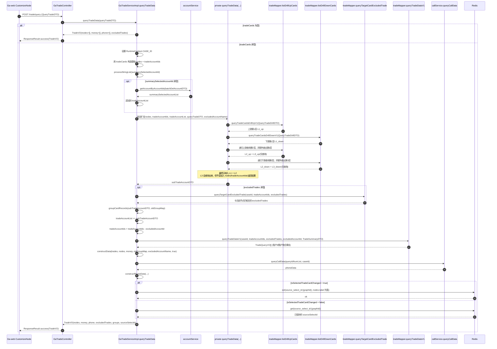

# Current Ga-web + skyable-cloud Case Graph Implementation Notes

工作区：`/Users/brian/Documents/Project/nanobot/nanobot-channel-webui`

基准目录：

- 前端：`/Users/brian/Documents/Project/公安系统/Ga-web`
- 后端：`/Users/brian/Documents/Project/公安系统/skyable-cloud`

目标：只记录原版 `Ga-web + skyable-cloud` 上图分析当前真实实现，不写方案，不写重构建议。

## 范围

- 前端重点文件：
  - `src/views/analysis/upper/index.vue`
  - `src/views/analysis/upper/customizeNode.vue`
  - `src/views/analysis/upper/GraphCheckboxList.vue`
  - `src/views/analysis/upper/dialogNewBuild.vue`
  - `src/views/analysis/upper/dialogSummary.vue`
  - `src/views/analysis/upper/dialogDetail.vue`
  - `src/views/analysis/upper/dialogDrillConfig.vue`
  - `src/views/analysis/upper/type.ts`
- 后端重点文件：
  - `cloud-data/src/main/java/com/skyable/cloud/data/controller/GaTradeController.java`
  - `cloud-data/src/main/java/com/skyable/cloud/data/controller/GaCaseGraphController.java`
  - `cloud-data/src/main/java/com/skyable/cloud/data/domain/dto/trade/QueryTradeDTO.java`
  - `cloud-data/src/main/java/com/skyable/cloud/data/domain/dto/trade/QueryTradeOverallDTO.java`
  - `cloud-data/src/main/java/com/skyable/cloud/data/domain/dto/trade/QueryTradeDetailDTO.java`
  - `cloud-data/src/main/java/com/skyable/cloud/data/domain/dto/trade/QueryTradeDrillDTO.java`
  - `cloud-data/src/main/java/com/skyable/cloud/data/domain/entity/GaCaseGraph.java`
  - `cloud-data/src/main/java/com/skyable/cloud/data/service/impl/GaTradeServiceImpl.java`
  - `cloud-data/src/main/java/com/skyable/cloud/data/service/impl/GaCaseGraphServiceImpl.java`
  - `cloud-data/src/main/resources/mapper/GaTradeMapper.xml`

## 1. 总体结构

当前实现不是一条单链路，而是两套并行状态机：

1. 图记录持久化链路
   - `/api/data/graph/add`
   - `/api/data/graph/detail`
   - `/api/data/graph/update`
   - `/api/data/graph/excludes`
   - `/api/data/graph/drill/config`
2. 主查询与图渲染链路
   - `/api/data/trade/query`
   - `/api/data/trade/summary`
   - `/api/data/trade/detail`
   - `/api/data/trade/target/detail`
   - `/api/data/trade/query/drilldown`
   - `/api/data/trade/query/drillup`
   - `/api/data/trade/query/drill`

图记录负责保存当前 tab 的图状态、排除状态、群组状态和画布内容；主查询负责根据这些状态重新生成 `nodes / money / phone`。

当前 nanobot 的关系图状态已调整为以 `case_graphs/{caseId}/{graphId}/graph.json` 为权威当前投影，`steps/*.json` 保存每次操作完成后的完整图快照。外层 graph snapshot 只作为图列表、图名、聊天绑定和配置索引，不再反向同步完整关系图状态。

## 2. 页面主流程

页面主交互是“左侧主体树 + 右侧图 tab + tab 内画布”。

### 2.1 左侧主体树

`GraphCheckboxList.vue` 会把案件下的嫌疑人账户组织为：

`全部对象 -> 嫌疑人 -> 账号`

树叶子节点真实携带的关键字段有：

- `accountId`
- `tradeCard`
- `accountName`
- `accountBank`
- `suspectId`
- `suspectIdNumber`
- `accountCategory`
- `isObtain`

左侧树除了返回勾选卡片列表，还会额外生成一组 `accountIdArray`。这组值不是单纯的 `accountId[]`，而是混合了三类值：

1. 每个单独 `accountId`
2. 同一 `suspectId` 下多个 `accountId` 的下划线组合值
3. 当前全部勾选卡片按数字排序后的总组合值

这一组值被用来标记“交易主体”。

### 2.2 图 tab 的创建与进入

- 页面进入后先按案件拉 `/api/data/graph/list`，已有图直接渲染成 tab。
- `新建` 按钮通过 `dialogNewBuild.vue` 调 `/api/data/graph/add`，只创建图记录。
- 新建成功后，右侧新增一个 tab，`graphId` 来自后端返回。
- 切换 tab 时，页面会把当前 `graphId`、左侧当前勾选、金额时间过滤和 `selectedAccountIdArray` 传给 `CustomizeNode`。

### 2.3 “分析上图”按钮的真实行为

“分析上图”并不直接等于“新建图”。

- 如果当前已经有 tab：
  - 先把左侧当前勾选同步到当前 tab
  - 再调用 `customizeNode.getTradeInfoByCards(..., { onlyGroupMap: true })`
- 如果当前没有 tab：
  - 先走 `/api/data/graph/add`
  - 新 tab 创建后再补一次 `getTradeInfoByCards`

`onlyGroupMap: true` 的真实效果不是“只传群组”，而是：

- 以左侧当前勾选重建这次分析的基线
- 清空部分累计排除/汇总状态
- 重新触发主查询

## 3. 图记录持久化链路

### 3.1 `/api/data/graph/add`

前端真实发送字段：

- `caseId`
- `graphName`
- `tradeCards`
- `saveToClue`
- `clueName`

后端 `GaCaseGraphServiceImpl.addCaseGraph(...)` 会创建 `GaCaseGraph` 记录。当前这一步不负责生成 `graphData`。

### 3.2 `/api/data/graph/detail`

进入已有图时，`CustomizeNode` 会先拉 `graph/detail`，然后把返回值回填到运行态 `graphInfo`。

前端会读取和回填的字段至少有：

- `tradeCards`
- `groupMap`
- `graphData`
- `excludedTrades`
- `excludedAccountId`
- `summarySelectedAccountId`
- `drillNums`
- `drillType`
- `minAmount`
- `maxAmount`

前端还会尝试读取：

- `excludedAccountName`
- `summarySelectedAccountName`

但这两个字段并不在后端 `GaCaseGraph` 实体里。

### 3.3 `/api/data/graph/update`

前端保存画布时，`customizeNode.getCurGraphInfo()` 返回的数据包含：

- `graphId`
- `caseId`
- `graphName`
- `graphContent`
- `tradeCards`
- `groupMap`
- `graphData`
- `excludedTrades`
- `excludedAccountId`
- `summarySelectedAccountId`
- `excludedAccountName`
- `summarySelectedAccountName`

后端 `CaseGraphEditDto` 和 `GaCaseGraphServiceImpl.updateCaseGraph(...)` 当前真正能持久化的字段是：

- `graphContent`
- `graphName`
- `sourceSelectId`
- `tradeCards`
- `groupMap`
- `graphData`
- `excludedTrades`
- `excludedAccountId`
- `summarySelectedAccountId`

也就是说，前端发送的 `excludedAccountName`、`summarySelectedAccountName` 不在这条持久化链路的 DTO 中。

### 3.4 `/api/data/graph/excludes`

`dialogDetail.vue` 里的“更新”按钮走的是 `/api/data/graph/excludes`，不是主查询。

这条链路只更新：

- `excludes` -> 后端落到 `excludedTrades`
- `tradeCards`

后端保存后会通过 websocket 通知当前图更新。

### 3.5 `/api/data/graph/drill/config`

钻取配置单独保存到图记录：

- `drillNums`
- `drillType`
- `minAmount`
- `maxAmount`

## 4. 主查询 `/api/data/trade/query`

### 4.1 前端真实请求来源

主查询请求由 `customizeNode.vue` 组装。

当前前端会发送的核心字段有：

- `caseId`
- `graphId`
- `tradeCards`
- `groupMap`
- `excludedTrades`
- `excludedAccountId`
- `excludedAccountName`
- `summarySelectedAccountId`
- `summarySelectedAccountName`
- `isSelectedTradeCardChanged`
- `minAmount`
- `maxAmount`
- `startTime`
- `endTime`

前端还会额外发送：

- `groupNames`
- `tradeDirectionList`

但这两个字段不在后端 `QueryTradeDTO` 中，当前已确认 `/trade/query` 的 service 逻辑也没有读取它们。

### 4.2 进入 controller 后真正有机会生效的字段

控制器签名是：

- `POST /trade/query`
- `@RequestBody @Validated QueryTradeDTO`

所以从后端代码角度，当前这条链路真正有机会参与逻辑的字段只来自 `QueryTradeDTO`：

- `caseId`
- `graphId`
- `tradeCards`
- `groupMap`
- `excludedTrades`
- `excludedAccountId`
- `excludedAccountName`
- `summarySelectedAccountId`
- `summarySelectedAccountName`
- `isSelectedTradeCardChanged`
- `minAmount`
- `maxAmount`
- `startTime`
- `endTime`

其中进一步确认：

- `summarySelectedAccountId` 会被 `/trade/query` 逻辑读取并生效
- `summarySelectedAccountName` 当前不参与 `/trade/query` 后端逻辑
- `graphId` 不参与 SQL 过滤，只用于 `sourceSelectId` 的 Redis 读写
- `isSelectedTradeCardChanged` 不参与 SQL 过滤，只影响 `sourceSelectId` 是重算还是回读 Redis

### 4.3 `tradeCards` 的真实来源

主查询用的 `tradeCards` 不是“左侧当前勾选的直接透传”，而是当前图运行态里的图基线：

- 初次分析上图时，基线来自左侧当前勾选
- 上下钻新增节点后，会 append 到 `tradeCardlist`
- 汇总分析勾选新增节点后，会通过 `summarySelectedAccountId` 注入
- 取消上图后，`tradeCardlist` 也会同步删除对应节点

### 4.4 `groupMap` 的真实语义

`groupMap` 不是 `groupId -> groupItem`。

当前真实语义是：

- key: 群组内成员的 `accountId`
- value: 同一个群组对象 `groupId/groupName/tradeCard[]`

后端 `constructData(...)` 就是按 `payerId/payeeId` 去 `groupMap.containsKey(accountId)` 判断某个账户是否属于群组。

补充：

- `groupMap` 不参与主 SQL `queryTradeDataV1` 的 where 条件
- `groupMap` 主要在 Java 组装图时生效，用于把账户节点替换为群组节点、把群组之间的边再聚合
- `groupMap` 还会参与话单映射和自动同名分组的合并

### 4.5 `sourceSelectId` 的真实语义

`sourceSelectId` 这个名字带有误导性。

后端 `queryTradeData(...)` 里真实写入的是：

- `nodes.values().stream().map(TradeSuspectVO::getLabel)`

也就是当前源节点的名称列表，不是账户 id 列表。

这一组值被前端汇总分析当作“原始上图主体名称列表”来使用。

## 5. 后端 `queryTradeData(...)` 的确定性执行流程

`GaTradeServiceImpl.queryTradeData(QueryTradeDTO)` 的执行顺序是确定的，可以拆成 12 步。

### 5.1 第 0 步：空 `tradeCards` 直接返回空图

如果 `queryTradeDTO.getTradeCards().isEmpty()`：

- 直接返回 `TradeVO`
- `nodes = []`
- `money = []`
- `phone = []`
- `excludedTrades = queryTradeDTO.getExcludedTrades()`

不会继续做扩点、聚边、话单查询。

### 5.2 第 1 步：设置案件上下文

后端取 `caseId` 并写入 `RuntimeContext.CASE_ID`，后续 service 和 mapper 都使用这个上下文。

### 5.3 第 2 步：从 `tradeCards` 构造基础节点

后端先从 `queryTradeDTO.tradeCards` 构造基础节点 `nodes` 和基础账户 id 集合 `tradeAccountIds`。

每个基础节点的构造规则是：

- `node.id = accountId`
- `node.label = accountName`
- `node.accountId = accountId`
- `node.tradeCard = tradeCard`

同时满足以下条件才会加入：

1. `tradeCard.getAccountId()` 非空
2. `accountName` 不在 `excludedAccountName` 里

也就是说，基础节点的第一层过滤是按名称，不是按 id。

### 5.4 第 3 步：把 `summarySelectedAccountId` 注入到查询基线

如果前端带了 `summarySelectedAccountId`，后端会：

1. 调 `processStringList(...)` 解析成整数列表
2. 通过账户服务把这些账户对象查出来
3. 追加进 `tradeAccountList`

`processStringList(...)` 的确定性规则是：

- 普通字符串如 `"12"` -> `12`
- 组合字符串如 `"3_7_9"` -> `3, 7, 9`
- 最终去重，返回 `List<Integer>`

所以汇总分析新增节点的真实进入方式不是直接改图，而是通过下一次 `/trade/query` 把它们补进基线。

补充：

- `summarySelectedAccountName` 当前不会在 `/trade/query` 中参与任何后端逻辑

### 5.5 第 4 步：读取当前 `groupMap`

后端把 `queryTradeDTO.getGroupMap()` 赋给 `oldGroupMap`，后续：

- 自动同名分组会尝试把新分组并入 `oldGroupMap`
- `constructData(...)` 会用 `oldGroupMap` 做群组节点替换和群组边聚合
- 返回值里的 `groups` 也是 `oldGroupMap`

### 5.6 第 5 步：执行自动扩点

后端调用私有方法 `queryTradeData(nodes, tradeAccountIds, tradeAccountList, queryTradeDTO, excludedAccountName)` 做自动扩点。

这一步的行为是确定的：

1. 构造一个 `QueryTradeDrillDTO`
2. 固定设置 `drillType = 1`
3. 固定设置 `excludedCards = []`
4. 带上 `startTime/endTime/minAmount/maxAmount`
5. 先查上游第 1 层
6. 再查下游第 1 层
7. 再分别递归处理上游和下游

#### 5.6.1 自动扩点使用的 drill SQL 规则

自动扩点实际调用的是：

- `queryTradeCardsDrillUpV1(...)`
- `queryTradeCardsDrillDownV1(...)`

这两个 `V1` 方法会先调用真正的 drill 查询，再按 `excludedAccountName` 做一次名称过滤。

drill SQL 的确定性行为：

- `drillDown`
  - 以当前 `tradeCard` 集合作为付款方
  - 去找收款方
- `drillUp`
  - 以当前 `tradeCard` 集合作为收款方
  - 去找付款方
- 都基于 `baseQuery -> trade_info`
- 都会过滤：
  - `excludedTrades`
  - `minAmount`
  - `maxAmount`
  - `startTime`
  - `endTime`
- 两段 SQL 都固定 `limit 10`
- `drillType = 1` 时，排序优先级固定是按交易金额降序

#### 5.6.2 drill 结果如何变成 `TradeAccountDTO`

`queryTradeCardsDrillUp/Down(...)` 对 mapper 返回结果的处理规则是：

1. 每行结果里的 `accountStr` 按 `;` 拆成多个账户
2. 每个账户串再按 `_` 拆出：
   - `accountId`
   - `tradeCard`
   - `accountName`
   - `suspectIdNumber`
   - `accountBank`
3. 最终按 `TradeAccountDTO.accountId` 去重

这里的去重是确定性的，因为 `TradeAccountDTO.equals/hashCode` 只基于 `accountId`。

#### 5.6.3 Java 层不会再按 `limit` 截断 drill 结果

虽然 `QueryTradeDrillDTO` 和方法签名里都有 `limit`，但在 `getNewDrillNodes(...)` 中，真正按 `limit` 截断的代码已经被注释掉。

因此主查询自动扩点阶段的实际数量上限来自：

- SQL 的 `limit 10`

而不是来自 Java 层再次截断。

#### 5.6.4 自动扩点的递归层级是固定的

这里是这条链路最容易误解的部分。

代码里：

- `AtomicInteger levelUp = new AtomicInteger(2)`
- `AtomicInteger levelDown = new AtomicInteger(2)`

递归入口条件是：

- `if (level.decrementAndGet() >= 0 && !tradeAccountList.isEmpty())`

所以每个方向的真实执行顺序是：

1. 外层先查出第 1 层结果 `L1`
2. 第一次递归处理 `L1`，同时查出第 2 层结果 `L2`
3. 第二次递归处理 `L2`，同时查出第 3 层结果 `L3`
4. 第三次递归收到 `L3` 时，`level` 已经减到 `-1`，条件失败，`L3` 不会继续处理

因此最终结论是：

- 每个方向最终纳入结果的是：`L1 + L2`
- `L3` 会被查询出来，但不会加入最终 `nodes`、不会加入最终 `tradeAccountIds`、也不会加入最终返回的扩点结果

这不是“约两层”，而是代码层面固定的“两层纳入、一层丢弃”。

#### 5.6.5 自动扩点后对外返回的是什么

私有扩点方法返回的是：

- 上游 `L1 + L2`
- 下游 `L1 + L2`

然后主流程会：

- 把这些新增账户 append 到 `tradeAccountList`
- 把这些账户的 `accountId` append 到 `tradeAccountIds`
- 把对应节点 append 到 `nodes`

### 5.7 第 6 步：修正 `excludedTrades`

如果前端带了 `excludedTrades`，后端会调用 `queryTargetCardExcludedTrade(...)`。

这一步的真实作用不是“继续排除”，而是“先校正排除列表”：

- 只保留那些仍然与当前 `tradeAccountIds` 有关的排除项
- 与当前节点集合已经无关的旧排除项会被去掉

这样做是为了避免历史排除状态污染新的上图结果。

重点细节：

- `queryTargetCardExcludedTrade(...)` 实际查的是 `ga_trade.id`
- mapper 参数名虽然叫 `serialNumbers`
- 但 SQL 用的是 `gt.id IN (...)`

也就是说，主查询链路里的 `excludedTrades` 实际按交易表主键 `id` 生效，不是按 `serial_number` 生效。

### 5.8 第 7 步：自动同名分组并回写 `groupMap`

后端会对自动扩出来的节点调用 `groupCardRecords(subTradeAccountDTO, oldGroupMap)`。

这一步的确定性规则是：

1. 先按 `accountId` 去重
2. 过滤掉 `accountId == null` 的记录
3. 按 `accountName` 分组
4. 每组按 `accountId` 排序
5. 只有同名组数量大于 1 才生成群组
6. `groupId = accountId1_accountId2_...`
7. 对组内每个成员，如果 `oldGroupMap` 还没有这个 `accountId`，就写入：
   - key = `accountId`
   - value = `TradeGroupItemVO(groupId, groupName, tradeCard[])`

重点细节：

- 如果调用方传入的 `groupMap` 是 `null`，`groupCardRecords(...)` 内部虽然会 new 一个本地 `HashMap`，但不会返回给调用方
- 所以这一步只有在调用方提供了非空 `groupMap` 时，自动分组结果才真正能回写到主流程的 `oldGroupMap`

### 5.9 第 8 步：把 `excludedAccountId` 从目标账户集合中扣掉

在真正查主 SQL 之前，后端会执行：

- `tradeAccountIds = findDifferenceStream(tradeAccountIds, excludeAccountIds)`

也就是把 `excludedAccountId` 对应的账户 id 从目标账户集合中移除。

这一步和 `excludedAccountName` 不同：

- `excludedAccountName` 主要影响节点侧
- `excludedAccountId` 主要影响目标账户集合和主 SQL 对手方过滤

### 5.10 第 9 步：执行主 SQL `queryTradeDataV1`

扩点完成后，后端再调 `queryTradeDataV1(...)` 查询交易聚合事实。

这一步会吃：

- `accountIds`
- `excludedTrades`
- `excludedAccountId`
- `startTime`
- `endTime`
- `minAmount`
- `maxAmount`

#### 5.10.1 主 SQL 的数据源不是原始流水裸表

`queryTradeDataV1` 不是直接对 `ga_trade_${caseId}` 做简单查询。

它先通过 `baseQuery` 构造两个中间层：

1. `suspect_account`
   - 把 `ga_suspect_${caseId}` 和 `ga_account_${caseId}` 归一化关联
   - 同一账户按窗口函数 `row_number()` 保留一条主记录
2. `trade_info`
   - 把 `ga_trade_${caseId}` 和 `suspect_account` 做左右两侧 join
   - 同时补齐 payer/payee 两侧的：
     - 嫌疑人名
     - 身份证号
     - 账号名
     - 银行卡号
     - 账户 id

所以主查询真正聚合的基础数据，是一个已经归一化过的 `trade_info` 视图。

#### 5.10.2 主 SQL 的过滤顺序

`queryTradeDataV1` 的过滤顺序是：

1. 从 `trade_info` 生成 `trade_info_filter`
2. 在 `trade_info_filter` 上先过滤：
   - `trade_time >= startTime`
   - `trade_time <= endTime`
   - `trade_amount >= minAmount`
   - `trade_amount <= maxAmount`
   - `id NOT IN excludedTrades`
3. 再保留满足以下任一分支的记录：
   - `payee_account_id IN accountIds`，并且如果有 `excludedAccountId`，要求 `payer_account_id NOT IN excludedAccountId`
   - `payer_account_id IN accountIds`，并且如果有 `excludedAccountId`，要求 `payee_account_id NOT IN excludedAccountId`

重点细节：

- 主 SQL 中 `excludedTrades` 过滤的也是 `trade_info.id`
- 也就是底层交易表主键 `id`

#### 5.10.3 主 SQL 的分组结果

主 SQL 最终按以下键分组：

- `payerPayAccount/payerBankNumber`
- `payerSuspectName`
- `payerAccountId`
- `payeePayAccount/payeeBankNumber`
- `payeeSuspectName`
- `payeeAccountId`

每组输出：

- `amount = sum(trade_amount)`
- `count = count(*)`
- `startDate = min(trade_time)`
- `endDate = max(trade_time)`

所以 `queryTradeDataV1` 返回的不是逐笔流水，而是“账户对账户”的聚合交易事实。

### 5.11 第 10 步：Java 层把账户级事实组装成图

SQL 返回的还是账户级事实，后端在 `constructData(...)` 里进一步做：

- 群组节点替换
- 群组边聚合
- 群组内部交易剔除
- 节点裁剪

确定性规则如下：

1. 如果 `groupMap != null`：
   - 先把所有群组节点放入 `nodes`
   - 但如果群组名在 `excludedAccountName` 里，则该群组节点不放入 `nodes`
2. 遍历每条 `TradeQueryVO`
3. 如果 `payerAccountId/payeeAccountId` 任一为空，跳过
4. 默认边端点先是原始账户 id
5. 如果 `payerId` 命中 `groupMap`，把边的 `from` 改成群组 `groupId`
6. 如果 `payeeId` 命中 `groupMap`，把边的 `to` 改成群组 `groupId`
7. 如果边落在群组之间且 `from != to`，则继续做群组边聚合
8. 如果替换后 `from == to`，视为群组内部交易，不进入最终 `money`
9. 处理完成后，把所有群组成员账号节点从 `nodes` 中删掉，只保留群组节点

最终返回前端的 `money` 已经不是原始 SQL 逐笔记录，也不是原始 SQL 的账户对账户聚合结果，而是经过群组替换和群组边二次聚合后的图边结果。

重点细节：

- `constructData(...)` 里群组边的 `startDate/endDate` 合并代码存在实现偏差，当前行为应以代码现状为准，不应想当然理解为“严格最早开始、最晚结束”

### 5.12 第 11 步：补 `phone`

主查询最后还会额外查话单并组装 `phone`，然后一起返回。

具体过程是：

1. 遍历当前 `tradeAccountList`
2. 收集 `suspectIdNumber`
3. 构造 `idAndTradeMap`
   - 优先映射到普通节点 `nodeId`
   - 如果普通节点不存在但命中群组成员，则映射到群组 `groupId`
4. 调 `callService.queryCallData(queryIdNumList, caseId)`
5. 再把查询结果映射成 `phone`

### 5.13 第 12 步：维护 `sourceSelectId` 并返回 `TradeVO`

最后一步是维护 `sourceSelectId` 并组装返回值。

规则是：

- 如果 `isSelectedTradeCardChanged == true`
  - 直接取当前 `nodes.values().stream().map(TradeSuspectVO::getLabel)`
  - 写入 Redis，key 与 `graphId` 绑定
- 如果 `isSelectedTradeCardChanged == false`
  - 不重算
  - 直接从 Redis 回读旧的 `sourceSelectId`

然后返回：

- `nodes`
- `sourceSelectId`
- `money`
- `phone`
- `excludedTrades`
- `groups`

### 5.14 `/trade/query` 执行时序图

下面这张图只描述当前实际代码路径，不描述理想设计。

### 5.15 `/trade/query` 每一步输入/输出清单

下面按真实执行顺序列每一步输入和输出。

#### 5.15.1 Step 0: controller 入参绑定

输入：

- HTTP body
- `QueryTradeDTO`

输出：

- Java 对象 `queryTradeDTO`

重点：

- 只有 `QueryTradeDTO` 中声明的字段有机会进入 `/trade/query` 后端逻辑

#### 5.15.2 Step 1: 空图快速返回

输入：

- `queryTradeDTO.tradeCards`

输出：

- 如果为空，直接返回：
  - `nodes = []`
  - `money = []`
  - `phone = []`
  - `excludedTrades = queryTradeDTO.excludedTrades`

#### 5.15.3 Step 2: 设置案件上下文

输入：

- `queryTradeDTO.caseId`

输出：

- `RuntimeContext.CASE_ID = caseId`

#### 5.15.4 Step 3: 基础节点构造

输入：

- `queryTradeDTO.tradeCards`
- `queryTradeDTO.excludedAccountName`

输出：

- `nodes`
- `tradeAccountIds`
- `tradeAccountList`

规则：

- `node.id = accountId`
- `node.label = accountName`
- `node.accountId = accountId`
- `node.tradeCard = tradeCard`
- 若 `accountId` 为空，不入图
- 若 `accountName` 命中 `excludedAccountName`，不入图

#### 5.15.5 Step 4: 汇总新增节点补入基线

输入：

- `queryTradeDTO.summarySelectedAccountId`

输出：

- `summarySelectedIdlist`
- `summarySelectedAccountList`
- 更新后的 `tradeAccountList`

规则：

- `"3_7_9"` 会拆成 `3,7,9`
- 通过 `accountService.getAccountByAccountIds(...)` 查到账户对象
- 查到的账户对象会追加到 `tradeAccountList`

#### 5.15.6 Step 5: 读取 `groupMap`

输入：

- `queryTradeDTO.groupMap`

输出：

- `oldGroupMap`

用途：

- 供自动同名分组并入
- 供 `constructData(...)` 做群组节点替换和群组边聚合

#### 5.15.7 Step 6: 自动扩点总入口

输入：

- `nodes`
- `tradeAccountIds`
- `tradeAccountList`
- `queryTradeDTO.startTime/endTime/minAmount/maxAmount`
- `excludedAccountName`

输出：

- `subTradeAccountDTO`
- 更新后的 `nodes`
- 更新后的 `tradeAccountIds`

#### 5.15.8 Step 6A: 上下游第 1 层查询

输入：

- `QueryTradeDrillDTO`
  - `caseId`
  - `tradeCard = 当前 tradeAccountList`
  - `drillType = 1`
  - `excludedCards = []`
  - `excludedTrades`
  - `startTime/endTime/minAmount/maxAmount`

输出：

- `L1_up`
- `L1_down`

规则：

- `drillUp`: 当前节点作为收款方，找付款方
- `drillDown`: 当前节点作为付款方，找收款方
- SQL 固定 `limit 10`
- `drillType = 1` 按交易金额降序优先

#### 5.15.9 Step 6B: 递归查询第 2 层

输入：

- `L1_up`
- `L1_down`
- `levelUp = 2`
- `levelDown = 2`

输出：

- `L2_up`
- `L2_down`

规则：

- 第一次递归时 `level.decrementAndGet()` 结果为 `1`
- 条件成立，`L1` 会被处理并继续向下查询出 `L2`

#### 5.15.10 Step 6C: 额外查询第 3 层但丢弃

输入：

- `L2_up`
- `L2_down`

输出：

- `L3_up`
- `L3_down`

规则：

- 第二次递归时 `level.decrementAndGet()` 结果为 `0`
- 条件仍成立，所以会基于 `L2` 再查出 `L3`
- 第三次递归收到 `L3` 时，`level.decrementAndGet()` 结果为 `-1`
- 条件失败，所以 `L3` 不会被处理进：
  - `nodes`
  - `tradeAccountIds`
  - `subTradeAccountDTO`

确定结论：

- 每个方向最终纳入：`L1 + L2`
- 每个方向额外查询但丢弃：`L3`

#### 5.15.11 Step 6D: drill 结果转成账户对象并去重

输入：

- mapper 返回的 `accountStr`

输出：

- `TradeAccountDTO[]`

规则：

- 先按 `;` 拆多账户
- 再按 `_` 拆字段
- 最终按 `TradeAccountDTO.accountId` 去重
- Java 层不会再按 `limit` 截断

#### 5.15.12 Step 7: 修正 `excludedTrades`

输入：

- `caseId`
- `tradeAccountIds`
- `excludedTrades`

输出：

- 修正后的 `excludedTrades`

规则：

- 只保留仍与当前 `tradeAccountIds` 相关的排除项
- 无关的历史排除项会被剔除
- 这一步按 `ga_trade.id` 生效

#### 5.15.13 Step 8: 自动同名分组

输入：

- `subTradeAccountDTO`
- `oldGroupMap`

输出：

- 更新后的 `oldGroupMap`

规则：

- 先按 `accountId` 去重
- 再按 `accountName` 分组
- 只有同名数量大于 1 才生成群组
- `groupId = accountId1_accountId2_...`
- key 是成员 `accountId`
- value 是共享的 `TradeGroupItemVO`

注意：

- 若 `oldGroupMap == null`，方法内部 new 的本地 map 不会回传给主流程

#### 5.15.14 Step 9: 合并扩点结果并扣除 `excludedAccountId`

输入：

- `subTradeAccountDTO`
- `tradeAccountIds`
- `excludedAccountId`

输出：

- 更新后的 `tradeAccountList`
- 更新后的 `tradeAccountIds`

规则：

- 先把扩点结果追加进 `tradeAccountList`
- 再执行差集：`tradeAccountIds - excludedAccountId`

#### 5.15.15 Step 10: 主 SQL 聚合交易边

输入：

- `caseId`
- `tradeAccountIds`
- `excludedTrades`
- `excludedAccountId`
- `startTime/endTime/minAmount/maxAmount`

输出：

- `TradeQueryVO[] trades`

规则：

- 数据源是 `baseQuery` 生成的 `trade_info`
- 先按时间、金额、`excludedTrades(id)` 过滤
- 再保留：
  - `payee_account_id IN tradeAccountIds` 且 `payer_account_id NOT IN excludedAccountId`
  - 或 `payer_account_id IN tradeAccountIds` 且 `payee_account_id NOT IN excludedAccountId`
- 最终按 payer/payee 账户对聚合：
  - `amount`
  - `count`
  - `startDate`
  - `endDate`

#### 5.15.16 Step 11: Java 层组装图

输入：

- `trades`
- `nodes`
- `oldGroupMap`
- `excludedAccountName`

输出：

- `money`
- 更新后的 `nodes`

规则：

- 群组节点先入 `nodes`
- payer/payee 命中 `groupMap` 时，边端点替换成 `groupId`
- 群组间边继续聚合
- 群组内部交易不进入最终 `money`
- 群组成员单节点最终从 `nodes` 中删除

#### 5.15.17 Step 12: 补 `phone`

输入：

- `tradeAccountList`
- `caseId`

输出：

- `phone`

规则：

- 先从 `tradeAccountList` 收集 `suspectIdNumber`
- 再查 `callService.queryCallData(...)`
- 最后按节点或群组节点映射成 `phone`

#### 5.15.18 Step 13: 维护 `sourceSelectId`

输入：

- `isSelectedTradeCardChanged`
- `graphId`
- 当前 `nodes`

输出：

- `sourceSelectId`

规则：

- 若 `isSelectedTradeCardChanged = true`
  - 取 `nodes.label` 列表
  - 写 Redis
- 若 `isSelectedTradeCardChanged = false`
  - 不重算
  - 直接从 Redis 回读

重点：

- `sourceSelectId` 实际值是名称列表，不是 id 列表

#### 5.15.19 Step 14: 返回 `TradeVO`

输入：

- `nodes`
- `money`
- `phone`
- `excludedTrades`
- `oldGroupMap`
- `sourceSelectId`

输出：

- `TradeVO`
  - `nodes`
  - `money`
  - `phone`
  - `excludedTrades`
  - `groups`
  - `sourceSelectId`

## 6. `/trade/query` 重点关注的实现细节

### 6.1 自动扩点不是无限递归，也不是按 `drillNums` 控制

- 主查询自动扩点固定每个方向纳入两层
- 第 3 层会查询但丢弃
- `drillNums` 不参与 `/trade/query` 这条自动扩点链路

### 6.2 `excludedTrades` 在主查询和 drill 中口径不一致

- 主查询修正排除列表 `queryTargetCardExcludedTrade(...)`：按 `ga_trade.id`
- 主 SQL `queryTradeDataV1(...)`：按 `trade_info.id`
- drill SQL `listDrillDownCards/listDrillUpCards`：按 `serial_number`

因此当前系统里 `excludedTrades` 这个名字和底层实际过滤字段并不是完全一致的。

### 6.3 `summarySelectedAccountName` 不参与 `/trade/query`

当前已确认：

- 前端会发送 `summarySelectedAccountName`
- 后端 `QueryTradeDTO` 里有这个字段
- 但 `/trade/query` service 逻辑没有读取它

### 6.4 `groupNames` 和 `tradeDirectionList` 不参与 `/trade/query`

当前已确认：

- 前端会发送 `groupNames`
- 前端会发送 `tradeDirectionList`
- `/trade/query` 对应 DTO 中没有这两个字段
- 当前 `queryTradeData(...)` 逻辑没有读取它们

### 6.5 `groupMap` 为 `null` 时，自动同名分组结果不会真正回写主流程

`groupCardRecords(...)` 在 `oldGroupMap == null` 时虽然会 new 一个本地 `HashMap`，但不会返回给调用方。

所以自动同名分组能否真正影响本次主查询，取决于调用方是否传入了非空 `groupMap`。

## 7. 主查询响应的真实结构

后端主响应是 `TradeVO`，当前字段有：

- `nodes`
- `money`
- `phone`
- `excludedTrades`
- `groups`
- `sourceSelectId`

前端 `CustomizeNode` 对这些字段的真实消费方式是：

- `nodes / money / phone` -> 写入 `originData`
- `groups` -> 回填 `baseGroupsMap`，再与用户操作过的群组合并
- `excludedTrades` -> 更新当前图排除交易态
- `sourceSelectId` -> 当作名称列表保存到 `graphInfo.sourceSelectId`
- `nodes.map(node.id)` -> 回传给上层页面，用于左侧树联动勾选

## 8. 汇总分析 `/api/data/trade/summary`

### 8.1 打开方式

节点右键“汇总”或框选后点“汇总”，最终都走 `getTradeSummary(...)`，再打开 `dialogSummary.vue`。

汇总查询的目标 `targetCards` 优先来自：

- 如果命中群组节点，则用群组展开后的卡片集合
- 否则用当前节点自身卡片

### 8.2 请求结构

汇总分析请求走 `/api/data/trade/summary`，实际 DTO 是 `QueryTradeOverallDTO`。

前端会发送的关键字段有：

- `caseId`
- `targetCards`
- `accountName`
- `accountCard`
- `startTime`
- `endTime`
- `minAmount`
- `maxAmount`
- `jdFlag`
- `minInCount`
- `minOutCount`
- `sortField`
- `sortType`
- `selectNodeIds`

这里的 `selectNodeIds` 真实传值不是 id，而是当前上图节点的 `accountName` 列表。

### 8.3 SQL 语义

`listGraphTradeDataSummary` 的真实逻辑是：

1. 从 `graphTradeDetails` 取当前目标节点相关交易
2. 分别按付款方和收款方做汇总
3. 再按 `tradeCardName + counterpartName` 合并
4. 通过 `counterpartName IN selectNodeIds` 计算 `isSelected`

所以 `isSelected` 的真实语义是：

- `1`: 该对手名称已经属于当前图上主体名称集合
- `0`: 不属于当前图上主体名称集合

### 8.4 汇总弹窗内的累计状态

`dialogSummary.vue` 内部维护四组累计缓存：

- `excludedAccountIdCache`
- `excludedAccountNameCache`
- `summarySelectedAccountIdCache`
- `summarySelectedAccountNameCache`

它们的判断基线不是账户 id，而是 `sourceSelectId` 对应的名称集合。

真实规则是：

- 取消勾选且 `counterpartName` 属于 `sourceSelectId` 时，累计进 `excludedAccountId/Name`
- 勾选且 `counterpartName` 不属于 `sourceSelectId` 时，累计进 `summarySelectedAccountId/Name`

### 8.5 汇总“确定”后的真实后续动作

汇总点“确定”不会直接走图持久化接口。

它会把以下增量回传给 `CustomizeNode`：

- `excludedTrades`
- `curGraphTradeCards`
- `excludedAccountId`
- `graphAction`
- `summarySelectedAccountId`
- `excludedAccountName`
- `summarySelectedAccountName`
- `tradeDirectionList`

然后 `CustomizeNode` 把这些增量先合并进当前运行态 `graphInfo`，再重新调用一次 `/api/data/trade/query`。

## 9. 明细分析 `/api/data/trade/detail`

### 9.1 打开方式

节点右键“明细”或框选后点“明细”，都会打开 `dialogDetail.vue`。

这里的 `targetCards` 也优先按群组展开。

### 9.2 请求结构

`dialogDetail.vue` 请求 `/api/data/trade/detail`，实际 DTO 也是 `QueryTradeOverallDTO`。

请求关键字段有：

- `caseId`
- `targetCards`
- `excludedTrades`
- `dateRange/startTime/endTime`
- `accountName`
- `accountCard`
- `serialNumber`
- `page`
- `limit`
- `sortField`
- `sortType`

### 9.3 弹窗内状态语义

明细弹窗里的勾选列文案虽然显示“是否不上图”，但实际字段 `row.onGraph` 的使用语义是“这笔交易是否被排除”。

当前实现里：

- `item.onGraph === true` 表示这笔交易在 `excludedTrades` 集合内
- `item.onGraph === false` 表示这笔交易不在排除集合内

### 9.4 “更新”按钮的真实后续动作

明细弹窗点“更新”后：

1. 合并累计的 `cumulativeExcludedTradeIds`
2. 组装 `updateData = { caseId, graphId, excludes, tradeCards, clientId }`
3. 调 `/api/data/graph/excludes`
4. 后端保存后通过 websocket 通知当前图刷新

## 10. 边详情 `/api/data/trade/target/detail`

### 10.1 打开方式

图上单击一条边时，`CustomizeNode` 会：

1. 解析边的 `sourceId/targetId`
2. 从当前图节点或群组里展开出 `payerCards` 和 `payeeCards`
3. 调上层 `showTargetTransactionOverall(...)`

### 10.2 请求结构

边详情实际请求走 `/api/data/trade/target/detail`，DTO 是 `QueryTradeDetailDTO`。

请求字段有：

- `caseId`
- `payerCards`
- `payeeCards`
- `excludedTrades`
- `minAmount`
- `maxAmount`
- `startTime`
- `endTime`

### 10.3 返回与展示

后端返回 `List<TradeDetailVO>`，前端直接展示，并额外从边上下文补：

- `payer`
- `payee`
- `tradeAmount`
- `tradeCount`
- `tradeStart`
- `tradeEnd`

## 11. 上下钻接口

### 11.1 接口划分

当前后端有三条独立接口：

- `/api/data/trade/query/drilldown`
- `/api/data/trade/query/drillup`
- `/api/data/trade/query/drill`

三条接口都返回 `List<TradeAccountDTO>`，不直接返回整张图。

### 11.2 请求字段

真实 DTO `QueryTradeDrillDTO` 字段有：

- `caseId`
- `tradeCard`
- `limit`
- `drillType`
- `minAmount`
- `maxAmount`
- `startTime`
- `endTime`
- `excludedCards`
- `excludedTrades`

### 11.3 前端后续动作

前端拿到 drill 返回后，不是直接局部渲染边，而是：

1. 把返回的 `TradeAccountDTO` 节点并入当前 `tradeCardlist`
2. 同步到查询基线
3. 再重新调用一次主查询 `/api/data/trade/query`

### 11.4 SQL 里的固定限制

`listDrillDownCards` 和 `listDrillUpCards` 两段 SQL 末尾都是固定 `limit 10`。

所以当前“钻取个数”的最终生效并不只是前端传什么就严格等于什么，还受到原 SQL 固定 `limit 10` 的约束。

## 12. 群组的真实行为

### 12.1 自动同名分组

`CustomizeNode` 在部分初始化路径里会调用 `groupAllByAccountName()`。

它会扫描当前 `tradeCardlist`，把同名账户自动组成群组：

- `groupId = accountId1_accountId2_...`
- `groupName = accountName(n)`
- `tradeCard = 该群组下所有账户卡片`

### 12.2 运行时索引

当前前端至少维护三层群组相关状态：

- `groupMap`
- `userGroupsMap`
- `groupKeyMap`

其中：

- `groupMap`：成员 accountId -> groupItem
- `userGroupsMap`：用户当前保留的群组态
- `groupKeyMap`：groupId -> groupMembers[]，供节点解析和汇总/明细/边详情展开

### 12.3 取消群组

取消群组后，前端会更新本地群组运行态，并重新走主查询。

前端还会构造 `groupNames` 一起发往 `/trade/query`，但后端 `QueryTradeDTO` 中没有这个字段。

## 13. websocket 刷新链路

页面会建立以 `caseId + clientId` 为基础的 websocket 连接。

当前确认会触发 websocket 图更新通知的后端链路是 `/api/data/graph/excludes`。

收到消息后，前端会：

1. 判断是不是当前 tab 对应的 `graphId`
2. 如果是，则再次请求 `/api/data/graph/detail`
3. 再调用 `reloadGraphData(res.result)` 让当前图按数据库状态重新加载

## 14. 已确认的实现偏差和命名偏差

这里只记录事实，不给方案。

### 14.1 `sourceSelectId` 名称与实际值不一致

名字像“id 列表”，实际值是名称列表。

### 14.2 `selectNodeIds` 名称与实际值不一致

汇总分析里前端传的是当前图节点的 `accountName` 列表，SQL 也是按 `counterpartName` 比较。

### 14.3 前端发送字段多于后端 DTO 字段

当前已确认：

- `/trade/query` 前端会发送 `groupNames`
- `/trade/query` 前端会发送 `tradeDirectionList`
- `/graph/update` 前端会发送 `excludedAccountName`
- `/graph/update` 前端会发送 `summarySelectedAccountName`

这些字段都不在对应后端 DTO 的显式字段中。

### 14.4 图记录持久化字段少于前端运行态字段

前端运行态里长期维护：

- `excludedAccountName`
- `summarySelectedAccountName`
- `sourceSelectId`
- `dissolvedGroupNames`
- 其他显示配置

但后端 `GaCaseGraph` 真正持久化的只是其中一部分。

### 14.5 钻取数量不是单一来源

前端和 DTO 都有 `limit/drillNums` 概念，但底层 `listDrillDownCards/listDrillUpCards` SQL 固定 `limit 10`。

## 15. 当前实现的一句话总结

当前原版上图分析的真实模式是：

- 左侧主体树负责提供分析基线
- 图记录负责保存当前图的持久化状态
- `/trade/query` 负责用“基线 + 累计排除/汇总/群组状态”重新生成整张图
- 汇总分析、明细分析、边详情、上下钻都不是孤立功能，最终都会回流到这套图状态和主查询链路里
