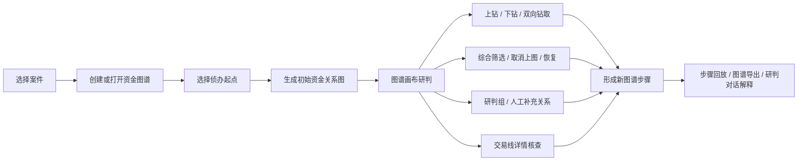

# 公安资金研判智能体建设需求说明

> 本说明用于梳理公安资金研判智能体的当前已实现能力、重点建设方向和需求边界确认事项，不展开内部实现细节。

## 一、建设背景

资金类案件中，办案人员通常需要同时处理银行流水、支付宝、微信、虚拟币、话单、人员关系、账户资料和人工补充材料。传统表格查询和单次绘图方式存在几个明显问题：

| 问题 | 办案影响 |
| --- | --- |
| 数据来源多、格式不统一 | 导入、清洗、字段对应和重复处理耗时，影响案件初期研判效率。 |
| 资金流转层级深 | 单次查询难以支撑逐层扩线、上下游追踪和持续研判。 |
| 图谱多次操作后容易混乱 | 扩图、筛选、排除、恢复、分组后，原有分析视图容易被打乱，影响复盘和汇报。 |
| 交易明细与图谱脱节 | 图上的一条资金线难以快速回到具体流水、排除依据和证据明细。 |
| 涉诈金额认定口径复杂 | 不能简单按嫌疑人收款金额认定，需要解释资金池、余额覆盖和最低可认定金额。 |
| 研判操作需要更低门槛 | 办案人员希望通过对话理解图谱变化、提出下一步研判意图，并由系统转成可确认的操作。 |

本项目是在已有系统基础上重新建设。原系统已经具备一定的数据导入、数据清洗、基础管理和查询能力，但上图分析、智能辅助、涉诈资金审计等核心研判能力难以继续维护和扩展。因此，当前新项目的重点不是简单替代原系统全部功能，而是把资金研判中最关键的“用数、上图、审计、AI 辅助”能力重新做清楚。

本文的核心目的，是把已经实现的功能讲清楚，并与业务方确认需求边界：原系统已经可用的数据导入、数据清洗、用户管理、基础查询等能力，后续是继续由原系统承载，还是逐步迁移到新系统，或由两套系统并行分工。

## 二、建设目标

| 目标 | 具体说明 |
| --- | --- |
| 承接案件资金数据 | 能够使用案件交易流水、主体、账号等数据开展上图分析、交易核查和涉诈审计。 |
| 建立资金关系图谱 | 从嫌疑人、账号或交易主体出发生成资金关系图，并支持逐层扩展。 |
| 建立连续研判机制 | 上图、钻取、筛选、排除、恢复、分组、补充线索等操作围绕同一张图持续开展。 |
| 建立交易证据核查能力 | 图上资金线可以回到逐笔流水，支撑筛选、排序、勾选、排除、恢复和导出。 |
| 建立涉诈资金审计能力 | 按资金池和最低可认定金额口径解释涉诈资金流向，保留证据明细。 |
| 建立智能体研判平台能力 | AI 不只是图谱旁边的问答助手，而是围绕案件、图谱、交易事实、审计结果、工具调用和工作空间文件运行的智能体方案。当前先服务上图研判过程，后续可把不同案件中的研判规则、办案经验、操作流程沉淀为可复用技能，让办案人员或管理员按案件类型创建、启用和复用不同研判技能。 |
| 明确新旧系统边界 | 确认数据导入、清洗、基础管理、查询统计等原系统能力，是继续由原系统承载，还是迁移到新系统。 |

当前项目的重点建设内容如下：

| 重点方向 | 需要讲清楚的内容 |
| --- | --- |
| 上图分析 | 当前不是复刻原版资金流向图，而是围绕案件资金关系图谱形成连续研判工作台，包括上图、钻取、筛选、排除、恢复、分组、补充关系、交易详情和步骤回放。 |
| AI 能力 | AI 是当前项目最核心的新增能力之一，不只是回答问题，而是以智能体运行时和技能机制承载图谱研判、操作转译、规则沉淀和经验复用。当前重点服务图研判过程，后续可把不同案件类型、不同资金模式、不同办案规则沉淀为技能，由办案人员在案件研判中选择和复用。 |
| 涉诈资金审计 | 审计重点不是简单统计收款金额，而是按被害人入账、资金池、余额覆盖和最低可认定金额解释涉诈资金流向。 |
| 新旧系统边界 | 数据导入、清洗、用户管理、基础查询等原系统已有能力，需要确认继续由原系统承载、迁移到新系统，还是两套系统并行。 |

## 三、业务主流程

系统业务主流程分为两条链路：一条是案件资金上图研判链路，一条是涉诈资金审计链路。两条链路共享案件数据和交易事实，但业务目的不同：上图研判用于发现关系、扩展线索、聚焦对象；涉诈审计用于解释涉案资金的认定口径、流向链路和证据依据。

### 1. 案件资金上图研判链路

| 阶段 | 办案动作 | 系统支撑 |
| --- | --- | --- |
| 选择案件 | 进入具体案件工作空间 | 案件、图谱、交易事实、审计结果和研判对话归入同一案件上下文。 |
| 创建或打开图谱 | 新建资金图，或继续分析已有资金图 | 一个案件支持多张图谱，适配不同线索、不同嫌疑人、不同研判方向。 |
| 选择侦办起点 | 选择嫌疑人、账号或交易主体 | 支持单起点和多起点；多起点分别计算上下游后合并成图。 |
| 生成初始资金关系图 | 查看主体、账号、资金线、金额、笔数和方向 | 形成第一版可操作资金图谱，不只是静态图片。 |
| 图谱画布研判 | 扩线、筛选、排除、恢复、分组、补充关系 | 所有操作围绕当前图谱持续开展，并保留研判过程。 |
| 交易线详情核查 | 点击资金线查看逐笔流水 | 支持按时间、金额、对象筛选排序，勾选排除或恢复具体交易。 |
| 步骤回放与导出 | 回看每一步研判变化，输出阶段结果 | 支持只读预览历史步骤、回到当前状态、导出图谱图片。 |
| 研判对话解释 | 询问当前图谱变化和下一步建议 | AI 解释图谱、总结线索、生成待确认操作，由办案人员确认后执行。 |

### 2. 涉诈资金审计链路

| 阶段 | 办案动作 | 系统支撑 |
| --- | --- | --- |
| 确定审计起点 | 明确被害人账号、被害人姓名或待审计主体 | 审计必须基于案件交易流水和明确条件发起。 |
| 识别被害人入账 | 找出进入中转账户或嫌疑相关账户的被害人资金 | 命中被害人条件的入账进入当前涉诈资金池。 |
| 累计资金池 | 按交易时间顺序滚动计算可追踪资金 | 避免只看单笔交易，保留时间线上的资金池变化。 |
| 识别嫌疑人出账 | 判断资金是否流向嫌疑人或下级对象 | 对嫌疑人出账计算可认定金额，对非嫌疑人出账按保守口径处理。 |
| 计算最低可认定金额 | 结合出账金额和出账后余额，给出更稳妥认定口径 | 解释“余额可覆盖”和“最低可认定”的关系，避免扩大认定范围。 |
| 生成证据明细 | 展示进入认定链的流水和保留底稿 | 支撑后续复核、汇报和材料整理。 |
| 继续追踪 | 从已认定对象继续追踪下级资金链 | 支持分层审计，逐步扩展涉诈资金流向。 |

## 四、核心能力矩阵

| 能力域 | 当前产品能力 | 办案价值 |
| --- | --- | --- |
| 案件与图谱管理 | 一个案件可维护多张资金关系图；支持新建、打开、删除、标签页切换；图谱和研判对话绑定。 | 适配同案多线索、多嫌疑人、多阶段研判。 |
| 数据承接 | 当前项目重点使用已进入案件库的交易流水、主体和账号数据开展上图分析、交易核查和审计。 | 先把数据使用和研判能力做深，避免在边界未确认前重复建设导入清洗流程。 |
| 导入清洗边界 | 数据导入、模板管理、数据清洗等能力原系统已有，是否迁移到新系统需要业务方确认。 | 决定新旧系统是并行分工，还是由新系统逐步替代。 |
| 初始上图 | 支持单个或多个侦办起点；按来款和去向分别查询；多个起点分别计算范围，避免互相挤占结果数量。 | 快速形成第一张可研判资金关系图。 |
| 钻取扩线 | 支持上钻、下钻、双向钻取；钻取配置保存到当前图谱；扩图时保留既有研判视图。 | 支撑围绕重点主体逐层追踪资金来源和去向。 |
| 图谱画布 | 展示主体、账号、资金线、金额、笔数、方向；支持小地图、缩放、拖动、节点拖拽、一跳高亮和 PNG 导出。 | 让复杂资金关系能够被办案人员直观看懂、持续操作和汇报。 |
| 可见操作 | 支持框选、多选、浮动操作条、上钻、下钻、双向钻取、取消上图、添加到组、归并成组、综合筛选、补充资金往来、标注现实关系。 | 重要操作不只藏在右键菜单中，降低使用门槛。 |
| 研判组 | 支持创建、收起、展开、拆分、编辑说明、移出成员；收起后保留组对外资金关系。 | 适合表达团伙、同控账户、同一分析对象，降低大图复杂度。 |
| 筛选排除 | 支持全图金额/时间筛选、主体取消上图和恢复、交易流水排除和恢复。 | 帮助办案人员聚焦有效交易，同时保留恢复和复核能力。 |
| 交易线详情 | 点击资金线查看付款方、收款方、金额、次数、最早/最晚交易、逐笔流水；支持筛选、排序、全选、排除、恢复。 | 图谱结论可以回到具体证据流水。 |
| 综合筛选 | 查询可继续加入图谱的交易对象，区分已上图、未上图、已取消上图，并支持单个或批量应用。 | 在不破坏当前图谱的前提下继续发现可扩展对象。 |
| 异常资金模式 | 识别疑似中转过账、回流闭环、集中收款、分散转移；输出判断依据和核查建议。 | 辅助发现值得优先核查的资金形态。 |
| 步骤回放 | 保存每次上图、钻取、筛选、排除、恢复、补充线索等步骤；支持只读预览和回到当前状态。 | 让研判过程可复盘、可解释、可汇报。 |
| 人工补充 | 支持创建临时交易主体、补充资金往来、标注现实关系；适合数据库外的办案发现。 | 将线下发现、口供、笔录、人工判断纳入同一张研判图。 |
| 智能体研判能力 | 以技能机制、工具调用、文件上下文和图谱上下文为基础，当前服务图谱研判和自然语言操作转译，后续支持把案件规则和办案经验沉淀为可复用技能。 | 让 AI 从一次性问答升级为可沉淀、可复用、可受控执行的办案能力。 |
| 涉诈资金审计 | 以案件交易流水为基础，按被害人入账和最低可认定金额口径展示审计结果、资金链和证据明细。 | 为涉诈金额认定、资金链追踪和材料整理提供依据。 |

## 五、重点产品能力说明

### 1. 案件资金上图

| 业务点 | 当前产品口径 |
| --- | --- |
| 侦办起点 | 可从嫌疑人、账号或交易主体发起分析。 |
| 多起点 | 多个起点分别查询来款和去向，再合并到同一张图。 |
| 默认范围 | 每个起点来款和去向默认各带出一定数量交易对手，后续可按图谱设置调整。 |
| 上钻 | 查看向当前主体转入资金的来源。 |
| 下钻 | 查看当前主体资金流向的对象。 |
| 双向钻取 | 同时查看上下游。 |
| 图谱稳定性 | 扩图时保留已有主体位置，只补充新增主体和资金线。 |
| 输出 | 主体、账号、资金线、方向、金额、笔数和交易明细入口。 |

### 2. 图谱画布与交易核查

| 能力 | 说明 |
| --- | --- |
| 资金线展示 | 展示方向、金额和交易笔数；粗细用于提示当前图中相对更值得关注的资金往来。 |
| 资金方向提示 | 悬停主体时，围绕当前主体解释流入和流出。 |
| 节点备注 | 办案人员可记录重点核查、已确认同伙、暂不处理等人工判断。 |
| 一跳高亮 | 点击或悬停主体时，高亮与其直接发生资金往来的主体和资金线。 |
| 交易线详情 | 点击资金线查看背后的逐笔流水，支持筛选、排序、全选、排除和恢复。 |
| 图谱导出 | 支持导出当前完整资金关系图图片。 |

### 3. 研判组

| 能力 | 说明 |
| --- | --- |
| 创建研判组 | 多选主体后创建，用于表达同一团伙、同一控制关系或同一分析对象。 |
| 收起研判组 | 降低大图复杂度，同时保留组对外资金往来。 |
| 展开研判组 | 查看组内原始主体和原始关系。 |
| 组对外资金线 | 收起时合并组内成员对同一外部主体、同一方向的多条资金线。 |
| 原始流水不丢失 | 点击聚合线仍查看原始付款方、收款方、账号和交易方式。 |

### 4. 异常资金模式识别

| 模式 | 判断含义 | 输出方式 |
| --- | --- | --- |
| 疑似中转过账 | 资金进入某主体后，又继续流向其他主体。 | 展示涉及主体、资金线、判断依据和核查建议。 |
| 疑似回流闭环 | 多个主体之间形成闭合资金流转。 | 圈选相关主体，提示可能存在回流或循环转账形态。 |
| 疑似集中收款 | 多个主体向同一主体转入资金。 | 提示可能存在归集资金或集中收款。 |
| 疑似分散转移 | 同一主体向多个主体转出资金。 | 提示可能存在拆分转移或资金扩散。 |

约束说明：异常资金模式只是研判提示，不等同于违法犯罪结论；系统不因此自动删除、过滤、移动或改写图谱。

### 5. 涉诈资金审计

涉诈资金审计不是简单统计嫌疑人收款金额，而是按时间线、资金池和余额口径计算更稳妥的最低可认定金额。

| 审计要点 | 说明 |
| --- | --- |
| 审计起点 | 必须有被害人账号或被害人姓名作为起点。 |
| 资金池 | 命中被害人条件的入账进入当前涉诈资金池。 |
| 嫌疑人出账 | 根据累计资金池和转出后余额计算最低可认定金额。 |
| 余额可覆盖 | 余额可能覆盖的入账参与总额计算，但不作为具体流向嫌疑人的证据。 |
| 非嫌疑人出账 | 按保守口径扣减或切断当前资金池。 |
| 逐层追踪 | 可从已认定嫌疑人继续追踪下一级资金链。 |
| 证据明细 | 展示全量流水底稿，区分进入认定链和保留底稿，并支持导出。 |

示例说明：

| 场景 | 计算解释 |
| --- | --- |
| 被害人 A、B、C 先后向中转账户转入 10,000 元 | 这 10,000 元进入当前涉诈资金池。 |
| 中转账户向嫌疑人转出 8,000 元，转出后余额 3,000 元 | 最保守假设下，余额 3,000 元可能仍包含被骗资金，因此最低可认定金额为 10,000 - 3,000 = 7,000 元。 |
| A、B 两笔合计 3,000 元可被余额覆盖 | 参与总额计算，但不能说一定具体流向嫌疑人。 |
| 后续转给非嫌疑人 | 按保守口径扣减或切断，避免扩大认定范围。 |

### 6. 智能体方案与 AI 研判能力

本项目的 AI 能力不是简单的聊天窗口，也不是给图谱增加一段文字说明，而是一套面向案件研判的智能体方案。它把案件图谱、交易事实、审计结果、工具调用、文件材料和技能机制组织在同一运行时中，让 AI 可以围绕真实办案上下文持续提供服务。

当前产品先把智能体能力落在图研判过程中：办案人员在上图、钻取、筛选、排除、恢复、分组、补充关系、查看交易详情和审计分析时，可以让智能体解释当前图谱、总结线索、提示异常、建议下一步，并把自然语言研判意图转成可确认操作。

更重要的是，底层智能体运行时已经支持以“技能”的方式组织研判能力。不同案件类型、不同资金模式、不同办案规则、不同单位经验，都可以沉淀为独立技能，在后续案件中被选择、启用和复用。这意味着系统沉淀的不是一次对话结果，而是一套可以不断积累的办案方法。

| 能力层 | 当前体现 | 业务价值 |
| --- | --- | --- |
| 案件上下文智能体 | 智能体围绕当前案件、当前图谱、最新步骤、交易事实和审计结果回答问题。 | AI 不脱离案件现场，回答和建议能够落到当前图谱和证据上。 |
| 图谱研判助手 | 解释图谱变化，总结新增主体、资金线、关键路径、异常资金形态和下一步研判方向。 | 帮助办案人员快速理解复杂图谱变化，降低大图研判门槛。 |
| 图谱操作助手 | 将自然语言中的筛选、钻取、取消上图、恢复、排除流水、补充资金往来、标注现实关系等意图转成待确认操作。 | 办案人员可以直接表达业务意图，不必记住每个按钮和入口。 |
| 技能化研判规则 | 通过技能承载特定案件类型、资金模式、分析规则、提示词和工具调用流程。 | 把个案中的研判经验沉淀为可复用能力，避免每个案件都从零摸索。 |
| 办案经验复用 | 后续可由办案人员或管理员创建不同技能，例如中转过账研判、回流闭环研判、团伙账户研判、涉诈资金审计说明等。 | 让优秀办案经验从个人经验变成系统能力，便于跨案件、跨人员复用。 |
| 工具和文件协同 | 智能体运行时支持技能选择、附件、工具调用、工具结果查看、工作空间文件浏览和全屏对话。 | 图谱分析、材料查看、工具结果和对话研判在同一个工作台内完成。 |
| 受控执行边界 | AI 可以生成操作建议和确认卡，但不直接改写案件事实、图谱文件或审计结论。 | 兼顾效率、办案安全和可审查性，避免 AI 绕过人工判断。 |

## 六、需求边界确认事项

当前项目已经把重点放在上图分析、AI 能力和涉诈资金审计上。原系统已经完成且可用的数据导入、数据清洗、用户管理、基础查询等功能，需要与业务方确认后续承载方式。

| 边界事项 | 原系统情况 | 当前项目情况 | 需业务方确认 |
| --- | --- | --- | --- |
| 数据导入 | 原系统已有金融、虚拟货币、支付宝、微信、话单等数据导入能力。 | 当前项目重点使用已整理入库的数据开展研判，不把导入流程作为当前核心能力。 | 是否继续由原系统完成导入，当前项目只读取结果数据；还是要求新系统重建导入能力。 |
| 数据清洗 | 原系统已有清洗规则、模板引用、去重、现金标志、无效数据处理等能力。 | 当前项目重点保证上图和审计所使用的数据口径清楚。 | 是否沿用原系统清洗结果；是否需要把关键清洗能力迁移到新系统。 |
| 原始文件与模板管理 | 原系统已有原始数据文件管理、导入模板管理、自定义模板管理。 | 当前项目暂以分析侧使用数据为主。 | 是否要求新系统管理原始文件和模板，还是由原系统继续承载。 |
| 用户、角色、部门、日志 | 原系统已有用户管理、角色管理、部门管理、登录日志和操作日志能力。 | 当前项目重点不在基础权限后台。 | 是否继续使用原系统账号和权限体系；是否需要新系统建设独立后台。 |
| 基础数据维护 | 原系统已有证件、币种、卡号段、借贷标志、银行网点等基础数据维护。 | 当前项目只在研判需要时使用相关基础数据结果。 | 是否由原系统继续维护基础字典；新系统是否只读取字典结果。 |
| 查询统计 | 原系统已有交易汇总、交易明细、共同关系、IP/MAC、进出账、活跃度等查询统计。 | 当前项目把查询能力主要嵌入图谱研判、交易线详情、综合筛选和审计明细中。 | 是否保留原系统作为通用查询入口；是否要求新系统补齐独立查询统计模块。 |
| 话单能力 | 原系统已有话单汇总、话单明细、话单人物关系分析方向。 | 当前项目重点是资金图谱和涉诈资金审计。 | 话单是否继续由原系统承载；是否需要纳入新系统后续人物关系分析。 |

建议业务方在需求确认时明确三种建设模式之一：

| 模式 | 说明 | 适用情况 |
| --- | --- | --- |
| 新旧系统并行 | 原系统继续承载导入、清洗、基础管理和通用查询；新系统承载上图分析、AI 研判和涉诈资金审计。 | 原系统导入清洗仍可用，且短期内不希望重复建设基础功能。 |
| 新系统逐步替代 | 先完成上图、AI、审计核心能力，再分阶段迁移导入、清洗、用户管理、查询统计等能力。 | 希望最终形成统一新系统，但接受分阶段迁移。 |
| 新系统全量重建 | 新系统同时重建导入、清洗、基础管理、查询、上图、AI、审计等全部能力。 | 希望完全停用原系统，并具备相应建设周期和预算。 |

## 七、完整需求清单与状态

本章节用于把系统完整建设需求归并成可沟通、可拆分、可规划的清单。状态分为三类：

| 状态 | 含义 |
| --- | --- |
| 当前已实现 | 当前产品已经形成相对明确的可用能力，可作为现有产品能力描述。 |
| 部分已实现 | 原版有该需求方向，当前产品已用新的业务方案覆盖其中一部分；表格中会说明“当前实现 / 与原版口径差异”。 |
| 原版已有 | 原版系统或原始需求清单中已有该能力；本文作为需求边界确认项记录，不表示当前新产品已经实现。 |

### 1. 系统建设与基础入口

| 模块 | 需求内容 | 状态 |
| --- | --- | --- |
| 系统设计 | 对系统架构、页面布局、业务流程和交互方式进行整体设计，形成详细设计说明。 | 原版已有 |
| 登录退出 | 支持用户登录、退出，保障系统访问身份可控。 | 原版已有 |
| 总览 | 展示当前登录人的案件统计、任务状态、超时提醒等信息。 | 原版已有 |

### 2. 案件、线索与账户管理

| 模块 | 需求内容 | 状态 |
| --- | --- | --- |
| 案件管理 | 支持案件新增、修改、删除、查询、设为当前案件；已结案案件只能查看，不能修改或删除。 | 原版已有 |
| 案件分配 | 同一案件可以分配给不同人员，不同人员负责不同线索。 | 原版已有 |
| 线索管理 | 支持线索新增、修改、删除、查询、导入、复制；线索必须归属案件，也可归属多个案件。 | 原版已有 |
| 账户管理 | 当前实现：当前上图可围绕嫌疑人、账号或交易主体发起分析，并能在交易事实中识别主体、账号和交易对象。与原版口径差异：原版账户管理更偏基础档案维护，包含姓名、身份证号、手机号、银行卡号、微信、支付宝、账户名、虚拟币账号、涉案案件号、案件类型、MAC、IP 等信息的增删改查和统一导出。 | 部分已实现 |
| 多账号信息 | 同一人员可维护多个手机号、账号、三方账号、账户名、虚拟币账号。 | 原版已有 |
| 账户导出 | 支持账户信息导出。 | 原版已有 |

### 3. 数据管理与数据导入

| 模块 | 需求内容 | 状态 |
| --- | --- | --- |
| 多源数据导入 | 支持金融、虚拟货币、支付宝、微信、话单类关系等数据导入。 | 原版已有 |
| 标准模板匹配 | 导入时自动匹配标准模板。 | 原版已有 |
| 手动列对应 | 非标准数据支持人工对应字段列。 | 原版已有 |
| 导入结果提示 | 导入完成后显示成功条数和失败条数。 | 原版已有 |
| 全量导入 | 数据导入按全量数据导入处理。 | 原版已有 |
| 原始文件留存 | 导入完成后保留原始数据文件。 | 原版已有 |
| 自动补充账户 | 导入数据时自动把识别出的账户信息补充到账户管理。 | 原版已有 |
| 案件线索绑定 | 数据导入必须选择案件和线索。 | 原版已有 |
| 跨案件线索引用 | 支持引用其他案件、其他线索的数据。 | 原版已有 |
| 原始数据文件管理 | 可按案件、线索、时间筛选已导入原始文件，并支持导出。 | 原版已有 |
| 数据导入模板管理 | 管理金融、支付宝、微信、话单等模板；金融类包括银行交易信息、银行开户信息、银行客户信息等模板。 | 原版已有 |
| 用户自定义模板 | 支持自定义模板编辑、导入、导出。 | 原版已有 |

### 4. 数据清洗

| 模块 | 需求内容 | 状态 |
| --- | --- | --- |
| 全量清洗 | 对已导入的金融、虚拟货币、支付宝、微信、话单等数据执行清洗。 | 原版已有 |
| 清洗后数据单独存储 | 清洗后的数据单独存储，用于后续查询、统计和分析。 | 原版已有 |
| 空值替换 | 支持空值字段替换，可引用其他字段填充。 | 原版已有 |
| 名称修正 | 对不规范导出数据中的户名、账号名变化进行批量修正。 | 原版已有 |
| 时间格式处理 | 支持交易时间、开户时间等字段格式标准化。 | 原版已有 |
| 现金标志 | 根据 ATM、卡取、卡存、柜台、现金、现存、现取、现支、存现、取现、提现等关键词识别现金相关交易。 | 原版已有 |
| 模式匹配 | 银行卡发生支付宝、财付通、理财、证券、基金等交易时，可生成银行卡与对应渠道的联合节点。 | 原版已有 |
| 数据比对 | 自动比对错误数据，并与历史数据对比；疑似问题提示人工确认。 | 原版已有 |
| 清洗模板引用 | 支持引用清洗规则模板，引用后可修改并另存为新模板。 | 原版已有 |
| 无效处理 | 去除冲正、红包领取失败等无效数据；重复数据需提示，避免重复导入。 | 原版已有 |
| 清洗规则管理 | 支持清洗规则创建、修改、导入、引用、导出，并可查看规则引用线索。 | 原版已有 |

### 5. 上图分析

上图分析是当前产品重点建设模块。下表不按原版功能逐字复刻，而是说明原版上图分析需求在当前产品中的对应承接方式。

| 原版需求项 | 当前对应实现 | 说明 | 状态 |
| --- | --- | --- | --- |
| 数据分析模型管理 | 异常资金模式识别、图谱研判副驾、可配置钻取范围 | 原版需求中提到资金分析类、话单人物关系类等模型。当前产品不把它做成办案人员需要理解的“模型引用”入口，而是把常用研判规则沉到图谱操作、异常模式提示和 AI 研判建议中。 | 部分已实现 |
| 线索合并及拆分 | 研判组功能 | 原版要求把同类账户或团伙账户合并/拆分；当前通过创建研判组、收起、展开、拆分、移出成员来承接，并在收起后保留组对外资金关系和原始流水。 | 当前已实现 |
| 资金交易流向分析 | 资金关系图谱工作台 | 当前从侦办起点生成资金图，展示主体、账号、资金线、方向、金额、笔数，并支持上下游钻取、交易详情核查、筛选排除、恢复、步骤回放和 AI 解释。当前不是复刻原版独立资金流向图，而是升级为可连续研判的上图工作台。 | 当前已实现 |
| 交易汇总 | 综合筛选、资金线汇总、研判组聚合线 | 原版强调按人或账户做交易汇总；当前主要通过综合筛选发现可加入图谱的交易对象，通过资金线展示双方汇总金额和笔数，通过研判组收起汇总组对外资金关系。 | 当前已实现 |
| 交易明细筛选联动图形 | 交易线详情筛选、排除与恢复 | 在交易线详情中筛选、勾选、排除或恢复具体流水后，图谱资金线金额、笔数和连接关系同步变化。 | 当前已实现 |
| 交易汇总筛选联动图形 | 综合筛选、全图筛选、取消上图与恢复 | 原版要求汇总筛选后图形同步变化；当前通过综合筛选、金额/时间全图筛选、主体取消上图和恢复承接。 | 当前已实现 |
| 多布局展示 | 稳定图谱布局、节点拖拽、位置保存 | 当前重点不是频繁切换多种布局，而是保证扩图、筛选、恢复后既有节点位置稳定，新增节点增量布局，办案人员调整的位置可保存。 | 当前已实现 |
| 列表和图形导出 | 图谱 PNG 导出、交易详情和审计明细作为后续结构化输出基础 | 当前已实现完整图谱图片导出；交易列表、汇总表、筛选结果、审计结果等结构化导出可在后续报告材料中统一设计。 | 部分已实现 |
| 手动画线 | 补充资金往来、标注现实关系 | 原版“手动画线关联上下级关系”在当前产品中拆成两类：补充资金往来用于补录数据库外资金关系，标注现实关系用于表达办案发现的现实关系。 | 当前已实现 |
| 默认节点数量 | 钻取数量设置 | 默认带出一定数量交易对手，支持在图谱设置中调整后续上钻、下钻、双向钻取数量。 | 当前已实现 |
| 回退前进 | 步骤回放 | 当前重点是保存每一步上图、钻取、筛选、排除、恢复、补充线索等研判步骤，支持只读预览历史步骤并回到当前状态；不是普通编辑器式撤销/重做。 | 当前已实现 |
| 图数据导出、打印、对齐、多选 | 框选、多选、节点拖动、图谱导出、步骤留痕 | 当前已实现多选、框选、节点拖动、完整图谱图片导出和步骤留痕；打印、自动对齐、结构化图数据导出可作为外围输出能力后续规划。 | 部分已实现 |
| 中心节点选择 | 侦办起点选择、节点上钻/下钻/双向钻取 | 原版强调任意节点作为中心节点；当前通过选择侦办起点生成首图，并在任意节点上继续上钻、下钻或双向钻取来实现中心转移。 | 当前已实现 |
| 上下级判断 | 上钻、下钻、资金方向提示 | 当前按付款方、收款方和交易方向表达上下游关系，并通过上钻、下钻、资金线方向和悬停高亮帮助办案人员判断资金来源与去向。 | 当前已实现 |
| 节点侧边展示 | 节点摘要、备注、一跳关联、资金线详情 | 当前支持围绕主体查看收支摘要、备注信息、一跳关联和相关资金线；点击资金线可查看起止时间、总金额、笔数和逐笔流水。 | 部分已实现 |
| 边明细展示 | 交易线详情 | 点击资金线后，可查看付款方、收款方、金额、次数、最早/最晚交易和逐笔流水，并支持筛选、排序、排除和恢复。 | 当前已实现 |
| 自定义选择账号和数据分析 | 多侦办起点、金额/时间条件、钻取数量、综合筛选 | 当前支持选择一个或多个侦办起点，并按金额、时间、钻取数量和综合筛选逐步形成研判范围。 | 当前已实现 |
| IP、MAC 查询上图 | IP、MAC 相关账号分析 | 该方向属于原版已有能力，当前可作为后续关系发现和数据查询能力保留。 | 原版已有 |
| 共同关系分析 | 综合筛选、共同交易对象发现 | 当前综合筛选可以发现可继续加入图谱的交易对象；原版独立共同关系分析列表和图形入口可作为后续查询分析能力补充。 | 部分已实现 |
| 图数分析 | 交易线详情、全图筛选、综合筛选、排除恢复 | 当前把“上图下数据”的联动拆到交易线详情、全图筛选、综合筛选和排除恢复中，筛选结果直接驱动图谱变化。 | 当前已实现 |
| 节点下钻 | 上钻、下钻、双向钻取 | 当前支持围绕任意主体继续查看资金来源、资金去向或双向资金往来，钻取数量可调整。 | 当前已实现 |
| 同进同出 | 资金方向提示、异常模式识别 | 当前用资金方向、上下游钻取和异常资金模式辅助识别资金流转特征；是否保留原版“同进同出”独立入口需后续确认。 | 部分已实现 |
| 话单类人物关系分析 | 话单人物关系图 | 原版已有话单人物关系分析能力，可作为资金关系图谱之外的人物关系研判方向记录。 | 原版已有 |

### 6. 数据查询与统计

| 模块 | 需求内容 | 状态 |
| --- | --- | --- |
| 交易汇总查询 | 按账号汇总、嫌疑人汇总、账号到嫌疑人汇总、嫌疑人到账号汇总、嫌疑人进出账汇总、账号进出账汇总分别展示。 | 原版已有 |
| 汇总分页展示 | 不同汇总类型通过不同分页或标签展示。 | 原版已有 |
| 组合查询 | 支持按案件、线索、时间范围和各类属性组合查询。 | 原版已有 |
| 交易明细查询 | 按数据类型展示交易明细，支持案件、线索、时间和属性组合查询。 | 原版已有 |
| 共同关系查询 | 按数据类型查询和统计嫌疑人直接交易账号，支持导出。 | 原版已有 |
| IP、MAC 查询 | 根据 IP、MAC 条件快速查询和分组统计。 | 原版已有 |
| 话单汇总查询 | 展示通话次数、通话时长等统计数据。 | 原版已有 |
| 话单明细查询 | 展示详细通话记录。 | 原版已有 |
| 进出账查询统计 | 统计嫌疑人账号进账和出账情况，支持导出。 | 原版已有 |
| 活跃度统计 | 统计活跃度 TOP10 的网点和账号，支持导出。 | 原版已有 |
| 查询模型管理 | 支持用户自定义查询模型，包含过滤条件、扩展字段和统计功能。 | 原版已有 |

### 7. 系统管理

| 模块 | 需求内容 | 状态 |
| --- | --- | --- |
| 用户管理 | 支持可登录用户新增、修改、删除、查询、密码修改；超级管理员可初始化密码。 | 原版已有 |
| 角色管理 | 支持角色新增、修改、删除、查询、菜单权限分配和数据权限分配。 | 原版已有 |
| 部门管理 | 支持使用单位部门信息维护。 | 原版已有 |
| 登录日志 | 记录登录账号、登录时间等登录行为。 | 原版已有 |
| 操作日志 | 记录操作人账号、操作模块、操作功能、操作类别、操作内容、操作时间等信息。 | 原版已有 |
| 全量操作留痕 | 对所有用户、所有功能操作进行操作记录。 | 原版已有 |
| 帮助文档 | 提供完整系统使用手册，支持在线查看和下载。 | 原版已有 |
| 页面帮助入口 | 每个功能模块页面右上角提供帮助图标，点击查看当前功能操作说明。 | 原版已有 |

### 8. 基础数据维护

| 模块 | 需求内容 | 状态 |
| --- | --- | --- |
| 证件信息管理 | 维护身份证、军官证、护照等证件类型，支持新增、修改、删除、查询。 | 原版已有 |
| 币种信息管理 | 维护各国币种信息。 | 原版已有 |
| 发行卡号段对照管理 | 维护各大银行发行卡号段，便于根据卡号识别银行。 | 原版已有 |
| 借贷标志信息管理 | 维护各大银行借贷标志，用于识别交易方向。 | 原版已有 |
| 银行网点信息管理 | 维护银行网点信息，支持新增、修改、删除、查询和导入。 | 原版已有 |

## 八、拟申报创新点和专利凝练方向

| 方向 | 可凝练内容 |
| --- | --- |
| 多源资金数据标准化 | 将银行流水、三方支付、虚拟币、话单、人员关系等数据统一导入案件上下文，形成可查询、可上图、可审计的数据底座。 |
| 稳定过程图谱 | 首图生成后，后续扩图、筛选、恢复等操作不打乱既有研判视图，支持连续研判和复盘。 |
| 交易事实驱动的图谱筛选 | 图上筛选、排除、恢复围绕当前图谱已有交易事实进行，保证图谱和明细一致。 |
| 研判组聚合表达 | 将多个主体临时聚合为研判组，收起时保留组对外资金关系，展开时回到原始主体和原始流水。 |
| 涉诈资金最低可认定金额 | 沿时间线累计资金池，用转出后余额解释最低可认定金额和余额可覆盖入账。 |
| 智能体技能沉淀与受控执行 | 通过智能体运行时把案件研判规则、操作流程和办案经验沉淀为可复用技能；对图谱变更类动作生成可确认操作，由办案人员确认后执行。 |

## 九、建设边界

| 内容 | 当前边界 |
| --- | --- |
| 异常资金模式 | 只作为研判提示，不直接作为犯罪结论。 |
| AI 智能体 | 智能体负责组织案件上下文、技能规则、工具调用和研判建议；涉及案件事实、图谱状态和审计结论的变更，仍需办案人员确认和把关。 |
| 话单查询 | 话单关系、话单汇总和话单明细属于原版已有需求，可作为人物关系研判和通信行为分析方向记录。 |
| 资金流向图 | 独立资金流向图需重新明确业务目标；当前以资金关系图和审计流向图承载主要需求。 |
| 历史步骤恢复 | 当前重点是步骤回看，任意历史步骤恢复为当前图可作为后续增强。 |
| 正式审计报告 | 当前重点是审计结果和证据明细，正式报告模板可后续补充。 |
